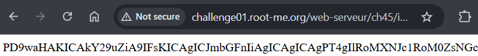

# File Inclusion

[HackTheBox](https://academy.hackthebox.com/module/23/section/250)

[PayloadAllTheThings](https://github.com/swisskyrepo/PayloadsAllTheThings/blob/master/File%20Inclusion/README.md)

# A. Giới thiệu

## File Inclusion là gì?

**FIle Inclusion** cho phép kẻ tấn công có thể xem các tệp trên máy chủ từ xa mà không cần nhìn thấy hoặc có thể thực thi các mã vào 1 mục tiêu bất kì trên trang web 

Local File Inclusion (LFI): Include file trên server

Remote File Inclusion (RFI): Include file từ ngoài server

(Khác nhau cái nguồn)

# B. Các kiểu tấn công

LFI

- Basic Bypasses: Double Encoding, NULL Byte Injection, **Path Truncation, Approved Paths**
- PHP Filters: `php://filter/read=convert.base64-encode/resource=...`

RFI

- PHP Wrappers: Data, Input, Expect
- LFI and File Uploads: Image upload, Zip Upload, Phar Upload
- Log Poisoning: PHP Session Poisoning, Server Log Poisoning

# C. Root Cause

- User input không được filter đúng cách, không sử dụng whitelist (open_basedir), blacklist
- Web nhận user input và truyền thằng vào các hàm như `include()`, `require()`, `fopen()`,..
- Trong php.ini, cấu hình`allow_url_include = On`, `allow_url_fopen = On`

# D. Challenges

## Root-me-1: [**Local File Inclusion**](https://www.root-me.org/en/Challenges/Web-Server/Local-File-Inclusion?lang=en)

Để hoàn thành lab thì cần phải vào được admin section

Có thể thấy trên URL có 2 parameter: `files=`và `f=`

Thử test xem web có filter input nào không bằng `?files=../`

Đã di chuyển đến 1 directory khác → Web không có filter input nào 

Vào admin và đọc file trong đó

Payload: `?files=../admin&f=index.php`

Done

## Root-me-2: [**Local File Inclusion - Double encoding**](https://www.root-me.org/en/Challenges/Web-Server/Local-File-Inclusion-Double-encoding)

Khi thử `../` thì web sẽ thông báo `Attack detected.`

Như tiêu đề của chall, ta sẽ thử double url encoding payload

Payload: `?page=%252e%252e%252fetc%252fpasswd`

Thông báo Warning cung cấp thông tin rằng web không cho phép truy cập đường dẫn `/etc/passwd`

Ta sẽ đổi hướng tiếp cận và sử dụng `PHP Filters` kết hợp với double url encoding

PHP Filters thường được sử dụng để Đọc và ghi dữ liệu với mã hóa đặc biệt (Base64,..)

Encoded Payload: `php%253A%252F%252Ffilter%252Fread%253Dconvert%252ebase64encode%252Fresource%253Dconfig`

Payload này hoạt động nhưng ta không biết chính xác trên web sẽ có những param nào…

Trong trường hợp này ta có thể `fuzzing` bằng [wordlist](https://github.com/whiteknight7/wordlist/blob/main/fuzz-lfi-params-list.txt), sử dụng tool như `ffuf` hoặc `burp intruder` và filter by length

Payload: `page=php%253A%252F%252Ffilter%252Fread%253Dconvert%252ebase64encode%252Fresource%253Dconf`

Bây giờ chỉ cần decode base64 là xong

## Root-me-3: [Remote File Inclusion](https://www.root-me.org/en/Challenges/Web-Server/Remote-File-Inclusion)

Lấy PHP source code

Thử `../`

Có thể thấy web đã thêm vào `_lang.php` ngay sau input

Thử bybass bằng `Null Bytes` (%00)

Việc thêm Null Bytes không còn hoạt động, điều này xảy ra khi php version ≥ 5.3.4 đã chặn kiểu bybass này

Trong php ta có thể dùng `?` để tách url và query string, như vậy `_lang.php` sẽ nằm ngoài `?lang`. Khi đưa vào hàm sẽ là `include("https://url?")`  → Bybass được

Thử truyền 1 url bất kỳ vào vào thêm `?` ngay sau đó

Ok, như vậy có thể dùng cách này để truyền payload thông qua url

Dùng pastebin (dịch vụ trực tuyến cho phép người dùng lưu trữ và chia sẻ văn bản) để lưu payload

Done

## Root-me-4: [**PHP - Filters**](https://www.root-me.org/en/Challenges/Web-Server/PHP-Filters)

Lấy password của admin

Dùng php filter với resource là các param phổ biến, có thể thử burst force bằng burp intruder

Payload: `php://filter/convert.base64-encode/resource=config.php`

Base64 decode:

