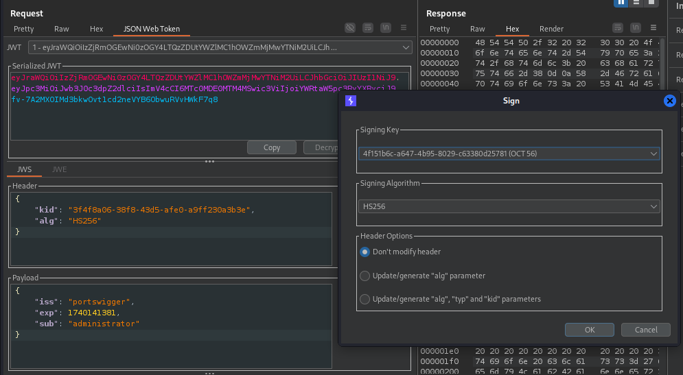

# JWT Attack

# **Lab1: JWT authentication bypass via unverified signature**

Các thư viện JWT như jsonwebtoken trong Node.js thường cung cấp hai phương thức khác nhau: một để xác minh token **[verify()]** và một chỉ để giải mã token **[decode()]**

Sau khi đăng nhập vào tài khoản được cấp và sử dụng JWT editor extension trong BurpSuite ta có thể thấy được cookie

Tạo một signature random trong JWT editor

Nếu như server **không xác minh signature** của một JWT được gửi đến thì ta có thể tùy ý chỉnh sửa JWT và dùng một signature giả mạo mà **vẫn được chấp nhập**

Trong Repeater chỉ cần chỉnh sửa tử “wiener” thành “administrator” và **sgin** thì ta đã giả mạo admin thành công!!

Sau đó ta chỉ cần vào trang /admin và xóa user carlos (/admin/delete?username=carlos)

# **Lab2: JWT authentication bypass via flawed signature verification**

JWT format được chia thành 3 phần: header, payload, signature. Mỗi phần được tách nhau bằng dấu “.”, nếu như header và payload chỉ được mã hóa bằng base64 thì **signature** sẽ được hash và encrypt bằng nhiều loại **algorithm** khác nhau

Ví dụ:

Đăng nhập vào tài khoản có sẳn

Kiểm tra phần header của JWT cookie, ta thấy rằng signature sẽ được xác thực bằng alg: “RS256”.

Nếu như server **không từ chối các JWT không có signature** thì ta có thể set alg thành none và giả mạo admin

Alg parameter cho server biết algorithm nào được sử dụng để sign JWT và algorithm đó cũng sẽ dùng để xác minh signature. Khi alg có giá trị none tức là phần signature trong JWT không còn cần thiết nữa.

# Lab3: JWT authentication bypass via weak signing key

Đăng nhập vào tài khoản có sẳn

Kiểm tra phần JWT header, ta thấy rằng HS256 algorithm được dùng để xác thức signature. HS256 sử dụng 1 string tùy ý dùng để làm key đối xứng symmetric (vừa sign vừa verify token)

Nếu như **key quá dễ đoán** thì ta có thể dùng hashcat để brute-force key

Chú thích:

- [-a 0]: mode tấn công bằng từ điển
- [-m 16500]: mã của hash-type

Có thể xem mã hash-type bằng cách gõ –help

Sau khi brute-force thành công, ta sẽ có key cho HS256 là **secret1**

Encode “secret1” sang base64

Tạo 1 signing key mới trong JWT editor và sửa giá trị “k” thành “secret1” khi đã được mã hóa base64

Sửa sub = administrator, sign bằng key mới vừa tạo và xóa carlos

# Lab4: JWT authentication bypass via jwk header injection

Trong lab này server **cho phép public key được nhúng (embed) trong JWT** thông qua JWK parameter mà không check xem key có đến từ một nguồn đáng tin cậy ví dụ như JWKS Endpoint hay không

Private key va public key là gì?

Nguồn: https://www.youtube.com/watch?v=P2CPd9ynFLg

Một số thuật toán mã hóa bất đối xứng như RSA sẽ có 1 cặp key, trong trường hợp của JWT thì sẽ là:

+ Private key: được server dùng để sign JWT (bí mật)

+ Public key: được client dùng để xác thực xem JWT có được sign bằng Private key từ server hay không (công khai)

Trong JWT editor, tạo 1 cặp RSA key với private key và public key (2 key có quan hệ toán học với nhau) với format JWT

+ Private key giả dùng để sign JWT

+ Public key giả dùng để embed vào JWT

Sau đó chọn **attack embeded JWK** vào JWT header với RSA key vừa tạo và sửa sub = administrator và xóa carlos

# Lab5: JWT authentication bypass via jku header injection

Trong bài lab này server có chép JKU parameter trong JWT header nhưng lại **không check URL trong JKU có đến từ nguồn đáng tin cậy** hay không

+ JKU (JSON Web key set URL): là một URL chứa tập hợp JKWS (JSON web key set) mà từ đó client có thể lấy các Public key sau khi đã trích xuát Key ID (kid) từ JWT header

+ Key ID giúp xác định đúng Public key nào trong JWKS để xác thực JWT (1 kid tương ứng 1 public key từ JKU)

Đăng nhập vào tk và truy cập exploit server với URL: [https://exploit-0aef00ce04a058ade675427701a5001d.exploit-server.net/exploit](https://exploit-0aef00ce04a058ade675427701a5001d.exploit-server.net/exploit)

Trong JWT editor, tạo 1 cặp khóa RSA và **copy Public key as JWK,** thêm danh sách key trong phần Body và ấn vào STORE

Sau đó vào trong Repeater, sửa giá trị của “kid” parameter thành “kid” ứng với public key vừa tạo trên exploit server

Thêm “jku” parameter có giá trị là URL của exploit server

Sửa sub = adminstrator

Sau đó sign bằng private key trong cặp key RSA đã tạo và xóa carlos trong /admin

# Lab6: JWT authentication bypass via kid header path traversal

Sau khi đăng nhập kiểm tra JWT header thì ta thấy alg đang dùng là mã hóa đối xứng HS256. Tức là chỉ 1 key được dùng để sign và xác thực

Trong bài lab này nếu như key được server lưu dưới dạng file mà không có phương pháp chống path traversal thì ta có thể sửa giá trị của “kid” thành đường dẫn tới /dev/null (1 empty file) do đó ta có thể sign JWT bằng 1 signature có giá trị “k” là rỗng đã được encode base64 mà vẫn được chấp nhận

Trong JWT editor tạo 1 key random với giá trị k = “AA==” (1 null byte)

Trong Repeater sửa kid = “../../../../../../../dev/null” và sub = administrator

Sau đó sign bằng key có k = null byte base64 vừa tạo và xóa carlos

