# NoSQL injection

# Lab1: Detecting NoSQL injection

Trong lab này product category filter được quản lí bởi MongoDB NoSQL database và có thể thực hiện NoSQL injection

Để hoàn thành lab thì phải hiển thị những unreleased product

## **Cách khai thác:**

Nếu \’ không gây ra lỗi thì máy chủ có thể bị tấn công

Kiểm tra xem người dùng có thể dùng các boolean conditions hay không

filter?category=Gifts%27+%26%26+1+%26%26+%27x (URL encoded)

(0 -> ko ra sp, 1-> có ra sp)

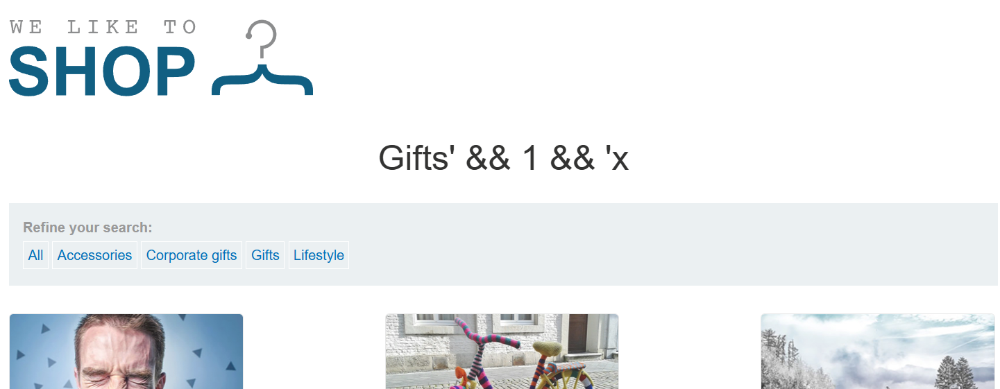

Điều chỉnh URL thành Gifts%27||1||%27 có nghĩa là:

this.category == 'Pets'||1||'' và in ra toàn bộ unreleased product

# Lab2: Exploiting NoSQL operator injection to bypass authentication

Trong lab này ta có thể NoSQL injection vào login function để có quyền admin

## **Cách khai thác:**

Đăng nhập vào tk đã cho:

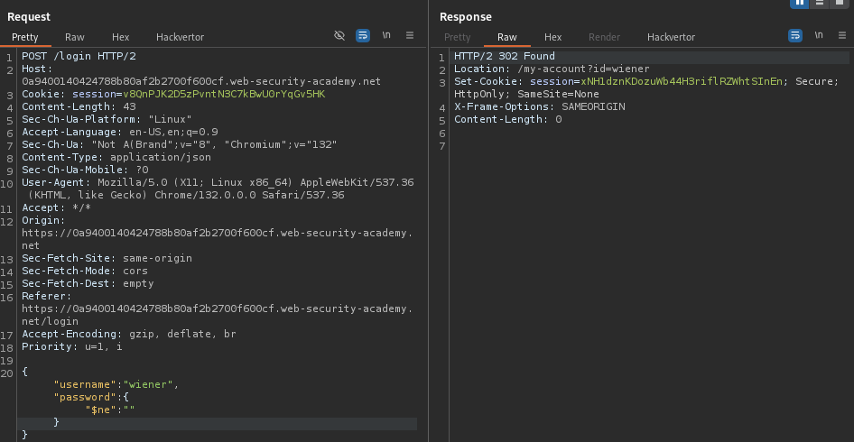

Thử chỉnh phần password thành {“$ne”:””} (&ne “” là not equel rỗng) thì vẫn có thể đăng nhập vào tài khoản wiener

Giải thích: đăng nhập vào username=wiener và với password khác rỗng

Nhưng khi sửa username=administrator thì không đăng nhập được, có thể vì không có user nào tên administrator

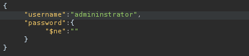

Thử dùng regex {“$regex”:”^a”} vào username (username sẽ là user đầu tiên có tên bắt đầu bằng chữ a và pass là {“$ne”:””}

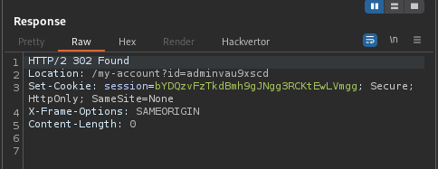

Vây là đã đăng nhập vào tk admin, chọn Show response on browser

# Lab3: Exploiting NoSQL injection to extract data

Trong lab này có vul NoSQLi trong lookup function có chức năng tìm kiếm user. Để hoàn thành lab thì phải khai thác được password của admin

## **Cách khai thác:**

Khi gửi 1 lookup HTTP request

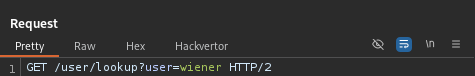

Thì NoSQL query có dạng

Đăng nhập vào tk đã cho, check xem có user tên admininistrator hay không

Mục đich ta sẽ tìm ra password của admin bằng query: administrator' && this.password[0] == 'a' || 'a'=='b (phải URL-encoded)

Giải thích: nếu có tên administrator trong db và ký tự password đầu tiên = ‘a’ thì sẽ có phản hồi True, còn nếu ko phải ‘a’ thì sẽ phản hồi False do có điều kiện OR 'a'=='b’ luôn là False

Trước đó ta sẽ tìm password length với cách thức tương tự bằng query:

administrator' && this.password.length < 20 || 'a'=='b

Sau vài lần thử thì password length = 8

Dùng Cluster Bomb trong Burp Intruder với payload chính ta có:

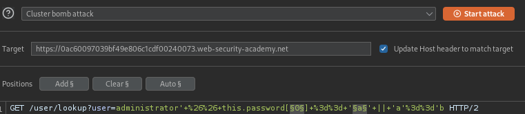

Ta sẽ dựa vào length của response để filter:

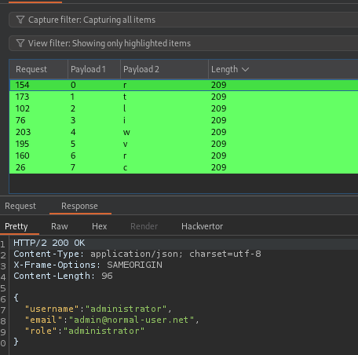

password: rtliwvrc

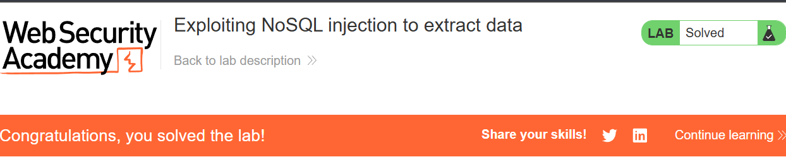

# Lab4: Exploiting NoSQL operator injection to extract unknown fields

Trong lab này có vul NoSQLi trong lookup function có chức năng tìm kiếm user. Để hoàn thành lab thì phải đăng nhập vào user carlos

## **Cách khai thác:**

Thử nhập username và password bất kỳ, trong Burp Repeater thử chỉnh sửa username và password như sau:

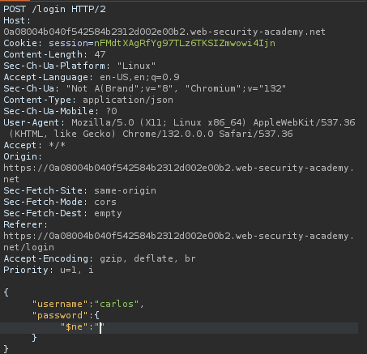

Kết quả phản hồi là Account locked, please reset password:

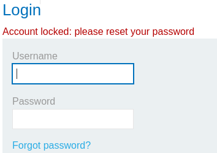

Test xem máy chủ có cho inject operator như $where không

Phản hồi: Invalid khi where = 0, account locked khi where = 1

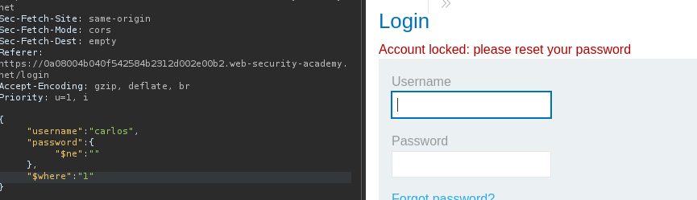

Như vậy ta có thể inject vào operator trong request, nếu vậy thì

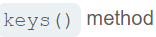

cũng sẽ hợp lệ

Keys() thường được dùng để liệt kê các thuộc tính ["username", "password"] trong dữ liệu JSON hiện tại (this)

Ta sẽ thử "$where":"Object.keys(this)[1].match(‘username’)"

Giải thích: [1] tương ứng username, [2] tương ứng password, match('^.{a}a.*') là regex

Kết quả là account locked 🡪 True

Như vậy đã có vài parameter bị ẩn đi, ta sẽ dùng cluster bomb trong Intruder để có thể tìm ra nó thông qua regex như thế này:

"$where":"Object.keys(this)[4].match('^.{§§}§§.*')"

Parameter bị ẩn đi là unlockToken

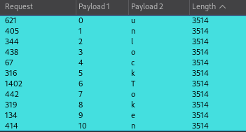

Sau đó ta lại dùng cluster bomb để tìm ra unlockToken của carlos

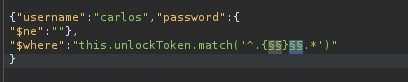

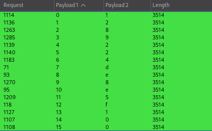

unlockToken: 1289224de8e5f100

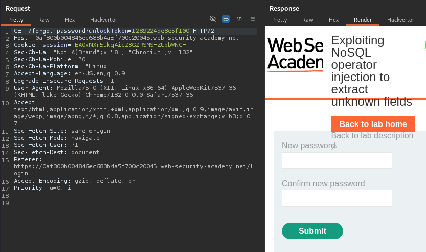

Sau đó bấm forgot password và thêm parameter unlockToken vào URL thì có thể đổi được mật khẩu của carlos

Đổi mật khẩu tùy ý và đăng nhập thành công!!

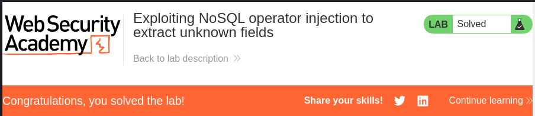