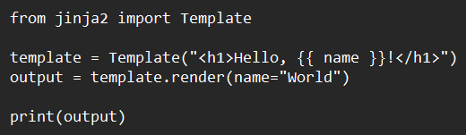
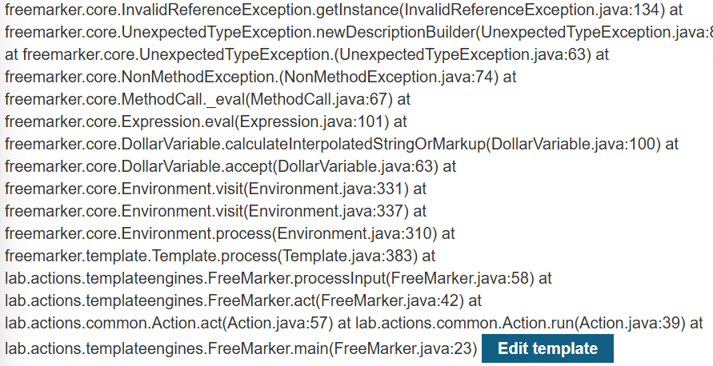
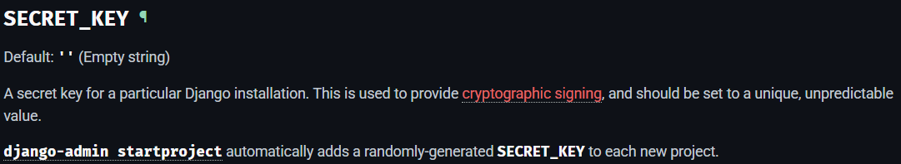

# Sever-side template injection (SSTI)

Template (biểu mẫu) có dạng:

Hello { username } (với username trong {} là giá trị có thể thay đổi)

Template engine:

- Template Engine là công cụ giúp tạo nội dung động bằng cách kết hợp template với dữ liệu từ backend (có thể là code python, javascript, PHP,...)
- Template Engine thay thế các biến trong template bằng dữ liệu thực tế và tạo ra nội dung hoàn chỉnh

Template Engine phổ biến:

Có rất nhiều Template Engine, mỗi loại đều có các syntax khác nhau phụ thuộc vào ngôn ngữ lập trình được sử dụng (ví dụ: Jinja2 (python), Freemarker (Java),  ERB (Ruby), Twig (PHP),…)

Ví dụ: 

# **Lab1: Basic server-side template injectionLab: Basic server-side template injection**

Trong lab này có vuln SSTI do thiết lập ERB template không an toàn. Để hoàn thành lab cần xóa `morale.txt` của carlos

## Root cause:

- Web cho phép người dùng nhập dữ liệu vào các biểu mẫu template mà máy chủ sẽ xử lý và render
- Không Escape input đúng cách (không cho phép ký tự nguy hiểm).

## Cách khai thác:

Khi bấm vào product đầu tiên, sẽ có 1 message như thế này. Có thể parameter này có liên kết với 1 function nào đó ở back-end để có thể hiện ra thông báo `Unfortunately this product is out of stock`

Ta có thể tận dụng parameter này để thực hiện SSTI

Khi truyền payload `<%=foobar%>`, website sẽ hiện ra thông báo lỗi và cho biết template engine mà server đang sử dụng là ERB template (dựa trên Ruby)

ERB template syntax:

Ta có thể sử dụng system command `puts` để thực hiện `ls`, `pwd`, `rm`

payload: `<%puts "ls"%>` (đổi “ thành backticks ` )

payload: `<%puts “rm morale.txt”%>` (đổi “ thành backticks ` )

# Lab2: Basic server-side template injection (code context)

Trong lab này có vuln SSTI do thiết lập Tornado template  không an toàn. Để hoàn thành lab cần xóa `morale.txt` của carlos

## Root cause:

- Web cho phép người dùng nhập dữ liệu vào các biểu mẫu template mà máy chủ sẽ xử lý và render
- Không Escape input đúng cách (không cho phép ký tự nguy hiểm).

## Cách khai thác:

Đăng nhập vào tk đã cho:

Sau khi inspect phần preferred name ta thấy được để hiện thị Name trên web cần phải truyền vào giá trị `user.name`.

 Lưu ý Tornado template sử dụng `python` với syntax:

- `{{ variable_name }}`: hiển thị giá trị biến
- ``: logic
- `{# comment #}`: comment

Bây giời hãy để ý đến chữ `Preferred name`, ta có thể đoán nó như là 1 cái tên khác của user để hiển thị cho mọi người khác xem. Như vậy ta sẽ thử kiểm tra phần bình luận

Payload: [`user.name](http://user.name)}}{{3*3}}` (escape khỏi user.name được truyền vào template và test SSTI)

Như vậy ta có thể thực hiện SSTI bằng code python

Payload: ``

Payload: ``

# **Lab3: Server-side template injection using documentation**

Để hoàn thành lab này cần phải xác định được template engine và tận dụng quyền của content-manager để edit template, thực hiện SSTI và xóa `morale.txt` của carlos

## Root cause:

- Có thể dễ dàng chỉnh sửa nội dung của template nếu đăng nhập được vào tài khoản của content-manager

## Cách khai thác:

Đăng nhập vào tk của content-manager

Sau khi tìm hiểu thì có thể xác định template engine đang dùng là `FreeMarker` (Java). Đọc Document của engine này ta có thể dùng command `exec` để thực hiện system command

Link: [https://freemarker.apache.org/docs/api/freemarker/template/utility/Execute.html](https://freemarker.apache.org/docs/api/freemarker/template/utility/Execute.html)

Payload:  `${exec( "/usr/bin/ls" )}`

Nhưng khi thực hiện lại xảy ra lỗi…

Tham khảo từ: [https://hackmd.io/@to016/By8xd9TAj](https://hackmd.io/@to016/By8xd9TAj)

Thử tạo mới 1 đối tượng `freemarker.template.utility.Execute()`

Payload: `${"freemarker.template.utility.Execute"?new()("ls")}`

Payload: `${"freemarker.template.utility.Execute"?new()("rm morale.txt")}`

# **Lab4: Server-side template injection in an unknown language with a documented exploit**

Để hoàn thành lab cần xác định template engine và tìm documented exploit online để SSTI và xóa `morale.txt` của carlos

## Cách khai thác:

Giống như lab1, khi bấm vào product đầu tiên, sẽ có 1 message thông báo `Unfortunately this product is out of stock`

Do không biết lab sử dụng template engine nào nên ta sẽ thử fuzzing để biết được server đang sử dụng loại nào

Payload: `${{<%[%'"}}%\`

Xác định được đây là Handlebars template engine (JavaScript)

Ta sẽ dùng payload này, chỉnh sửa return `require("child_process").exec("rm /home/carlos/morale.txt")` và URL encoded

# **Lab5: Server-side template injection with information disclosure via user-supplied objects**

Trong lab này có vuln SSTI tại một đối tượng nào đó được truyền vào template không an toàn, ta sẽ tận dụng để khai thác các dữ liệu nhạy cảm. Để hoàn thành lab cần phải lấy secret key của framwork. 

## Cách khai thác:

Đăng nhập vào tk của content-manager và vào edit template

Thử fuzzing: `${{<%[%'"}}%\`

Ta xác định được server đang sử dụng Python Web Application Framewrok `Django` và framework này có sử dụng template engine `Jinja`

Jinja syntax:

Ta sẽ thử debug để thu thập thêm các thông tin 

Payload: ``

Khi xem qua document của Django, ta biết được rằng **`SECRET_KEY`** sẽ được tạo default trong `settings` mỗi khi tạo 1 project mới

Để ý thấy rằng khi `debug` thì `'settings': <LazySettings "None">` nghĩa là Django chưa tải được cấu hình settings

Nhưng khi truy cập object `{{ settings }}`thì `<UserSettingsHolder>` đã load setting nhưng không hiển thị ra

Như vậy `settings` vẫn tồn tại và có thể lấy ra giá trị của **`SECRET_KEY`  ¯\_(ツ)_/¯**

Payload: `{{ settings.**SECRET_KEY** }}`

